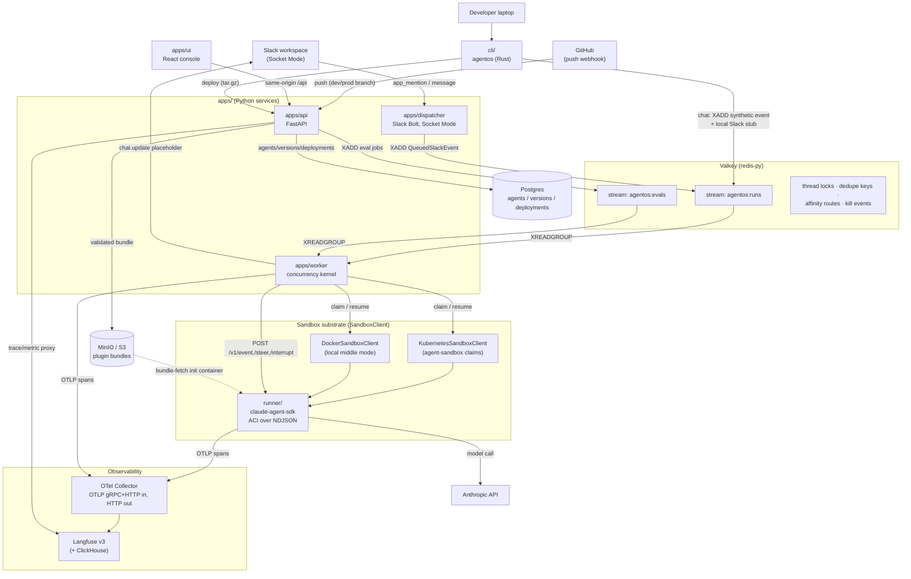
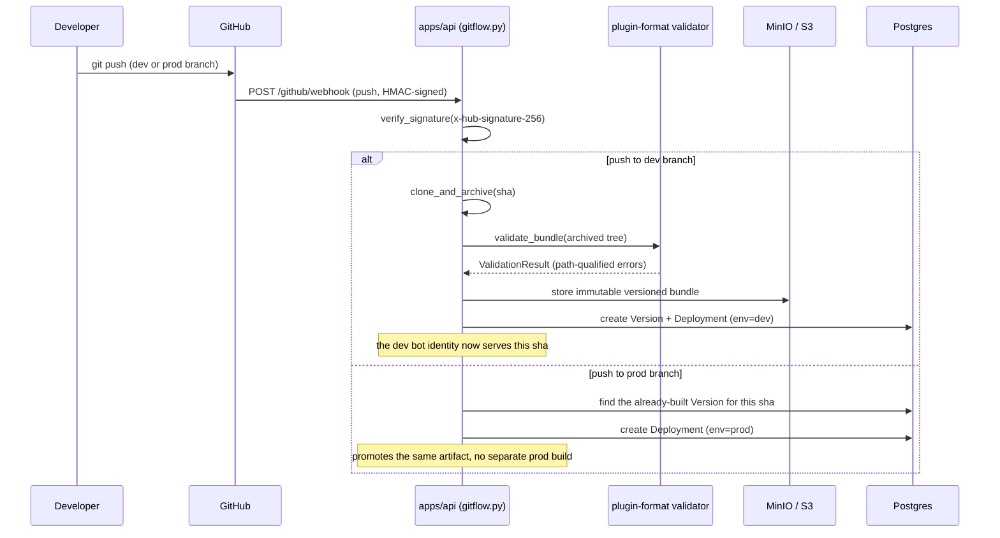
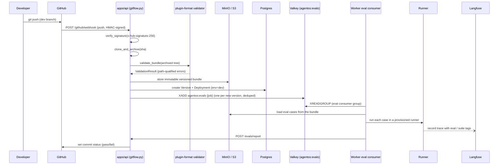

# AgentOS Architecture (as built)

AgentOS (codename **Relay**) turns a Slack thread into a conversation with a
versioned, sandboxed AI agent, and turns a git push into a deployment of that
agent. This document is the as-built map: the components, the two runtime modes
and what is identical between them, how one Slack turn and one eval run flow
through the system, how model credentials reach the model, and how traces come
back out.

Every claim carries a repo path you can jump to. Paths are relative to the repo
root. Where main does not yet contain something the design calls for, it is
marked **not yet in main** rather than described as shipped; those items are
tracked in [GitHub issues](https://github.com/curie-eng/agentos/issues).

The narrative "why" behind the big calls lives in the ADRs
([`docs/adr/`](docs/adr/)); this doc is the "what talks to what." It supersedes
the pre-build plans that the MVP was built from, which are preserved in git
history.

## 1. One-paragraph frame

Connect Slack, author a Claude-Code-format plugin (skills + tools + MCP) in the
browser or a repo, deploy it as a bot identity, and get traces, evals, budgets,
and git-flow for free. The core loop: a Slack mention lands on the dispatcher,
is enqueued on a Valkey stream, and is picked up by a worker kernel that owns
one live session per thread. The kernel claims a sandbox, drives a runner inside
it over a frozen HTTP/NDJSON protocol, the runner makes the real model call and
streams the reply back, and the worker edits that reply into the Slack
placeholder. The same worker, unchanged, runs against a real Kubernetes cluster
or a local Docker substrate; the CLI can stand in for Slack entirely. That
substrate-agnosticism is the thin-shim thesis and it is the load-bearing
design property of the whole system.

## 2. Component map



### Directory ownership and language

| Path | Language | Role |
|---|---|---|
| [`packages/aci-protocol`](packages/aci-protocol) | Python (Pydantic + codegen) | Frozen ACI session protocol + NDJSON events |
| [`packages/plugin-format`](packages/plugin-format) | Python (Pydantic + codegen) | Frozen Claude Code plugin bundle shape |
| [`apps/api`](apps/api) | Python (FastAPI) | Agents/versions/deployments, git-flow, evals, Langfuse proxy |
| [`apps/dispatcher`](apps/dispatcher) | Python (Slack Bolt) | Socket Mode ingress, dedupe, placeholder, enqueue |
| [`apps/worker`](apps/worker) | Python (redis-py) | Concurrency kernel, substrate, eval consumer |
| [`runner`](runner) | Python (claude-agent-sdk) | ACI session server inside the sandbox |
| [`apps/ui`](apps/ui) | React (Vite + TS) | Console: create/deploy, Runs, Metrics, Logs, Cost |
| [`cli`](cli) | Rust (clap + tokio) | `agentos` binary: init/deploy/chat/eval, local runner |
| [`charts/agentos`](charts/agentos) | Helm | Umbrella chart + security rails |
| [`tests/soak`](tests/soak) | Python | Soak/chaos harness (scaffold) |

The Python packages are one **uv workspace** (root
[`pyproject.toml`](pyproject.toml)); ruff, mypy, and pytest run across all
members from the root. See the repo [`CLAUDE.md`](CLAUDE.md) for verify commands.

**Adopted, not built** (ADR-0007, [`docs/adr/0007-adopt-not-build-boundaries.md`](docs/adr/0007-adopt-not-build-boundaries.md)):
Langfuse (traces + evals), Kubernetes Agent Sandbox (interactive runtime), Slack
Bolt (Socket Mode), Valkey Streams (queue), Postgres (app state), the OTel
Collector. AgentOS builds five things around that spine: the API, the
dispatcher, the worker+runner glue, the UI, and the CLI.

## 3. Two runtime modes, one worker: the thin-shim thesis

The platform never learns which substrate it is running on, and the runner never
learns whether the message came from Slack. Two seams make that true, and both
are real code, not aspiration.

### 3a. Substrate seam — `SandboxClient`

The worker talks to a `SandboxClient` Protocol
([`apps/worker/src/agentos_worker/sandbox/k8s.py:50`](apps/worker/src/agentos_worker/sandbox/k8s.py))
whose methods are `create_claim`, `get_claim`, `delete_claim`, `list_claims`,
`get_sandbox`, `set_sandbox_mode`. Two implementations satisfy it:

- **`KubernetesSandboxClient`** ([`apps/worker/src/agentos_worker/sandbox/k8s.py:101`](apps/worker/src/agentos_worker/sandbox/k8s.py)) — creates `SandboxClaim` CRDs against the agent-sandbox controller, binding a pre-warmed sandbox from a `SandboxWarmPool`. This is the production path.
- **`DockerSandboxClient`** ([`apps/worker/src/agentos_worker/sandbox/docker.py:93`](apps/worker/src/agentos_worker/sandbox/docker.py)) — runs the same runner image as a local Docker container. This is "middle mode": a full backend on a laptop with no Kubernetes.

Everything above the protocol (the kernel, routing, budgets, kill switch, resume
path) is identical across modes. The runner image, the ACI it speaks, and the
plugin bundle it loads are also identical; only the thing that starts the
container differs.

### 3b. Slack seam — `SLACK_API_BASE_URL` and the CLI stub

The worker reaches Slack only through a base URL
([`apps/worker/src/agentos_worker/config.py:146`](apps/worker/src/agentos_worker/config.py),
`SLACK_API_BASE_URL`). In production that points at Slack's Web API. The CLI's
`agentos chat` starts a local Slack Web API stub
([`cli/src/chat.rs`](cli/src/chat.rs)), prints the `SLACK_API_BASE_URL` to point
the worker at it ([`cli/src/chat.rs:269`](cli/src/chat.rs)), enqueues a synthetic
`QueuedSlackEvent` onto the very same `agentos:runs` stream the dispatcher uses,
and waits for the worker to finalize the turn by calling the stub's Slack API
back. The worker cannot distinguish the stub from Slack: same queue payload, same
`chat.update` call. This is what lets D1/F1/I1 and most of E1 be verified with no
Slack workspace at all.

Net effect: a developer can run the entire product loop — real model call
included — on a laptop with Docker and no cluster and no Slack, and the code
exercised is the code that runs in production.

## 4. Data flow: a Slack mention becomes a threaded reply

```mermaid
sequenceDiagram
    participant U as Slack user
    participant D as Dispatcher
    participant V as Valkey
    participant W as Worker kernel
    participant S as Sandbox substrate
    participant R as Runner
    participant A as Anthropic API
    participant O as OTel -> Langfuse

    U->>D: app_mention / DM message
    D->>V: SET dedupe:<event_id> NX EX ttl
    Note over D: retried delivery finds the key set,<br/>is dropped (still acked, never re-posted)
    D->>U: post placeholder ("On it...")
    D->>V: XADD agentos:runs {QueuedSlackEvent}

    W->>V: XREADGROUP (consumer group)
    W->>V: SET NX PX thread lock (routing CAS)
    W->>W: binding: resolve agent+version+bundle_ref by slack_channel
    alt no live turn for this thread
        W->>S: claim(thread_ts) / resume
        S-->>W: SandboxHandle (warm-pool bind)
        W->>R: POST /v1/event {message}
    else turn already live for this thread
        W->>R: POST /v1/steer {text}
        Note over W,R: 409 if the turn finished first (finish race);<br/>worker opens a fresh turn on the same idle sandbox
    end

    R->>A: model call (streaming)
    R-->>W: NDJSON: text_delta*, tool notes*, final
    R--)O: gen_ai spans (agent.run -> generation -> tool)
    W->>V: markers (done / side_effect_flag as seen)
    W->>U: chat.update the placeholder in place
    W->>V: XACK
```

The pieces, cited:

- **Dedupe + placeholder + enqueue** live in the dispatcher: dedupe SET NX at [`apps/dispatcher/src/agentos_dispatcher/queue.py:73`](apps/dispatcher/src/agentos_dispatcher/queue.py), placeholder post at [`apps/dispatcher/src/agentos_dispatcher/handlers.py:83`](apps/dispatcher/src/agentos_dispatcher/handlers.py), `XADD agentos:runs` at [`apps/dispatcher/src/agentos_dispatcher/queue.py:87`](apps/dispatcher/src/agentos_dispatcher/queue.py). Socket Mode handler at [`apps/dispatcher/src/agentos_dispatcher/app.py:99`](apps/dispatcher/src/agentos_dispatcher/app.py). The stream name and payload model (`QueuedSlackEvent`) are defined at [`apps/dispatcher/src/agentos_dispatcher/queue.py:48`](apps/dispatcher/src/agentos_dispatcher/queue.py) and [`config.py:46`](apps/dispatcher/src/agentos_dispatcher/config.py).
- **The kernel** consumes at [`apps/worker/src/agentos_worker/consumer.py:104`](apps/worker/src/agentos_worker/consumer.py) and processes at [`kernel.py:169`](apps/worker/src/agentos_worker/kernel.py). It talks to the runner over `POST /v1/event`, `/v1/steer`, `/v1/interrupt` ([`apps/worker/src/agentos_worker/runner_client.py:76`](apps/worker/src/agentos_worker/runner_client.py)) — the same routes the runner serves at [`runner/src/agentos_runner/server.py:46`](runner/src/agentos_runner/server.py).
- **Deployment binding**: a run resolves its agent, version, and `bundle_ref` by exact-match on `slack_channel` against the active deployment ([`apps/worker/src/agentos_worker/binding.py:49`](apps/worker/src/agentos_worker/binding.py)). This is how one worker serves many agents: the channel selects the bundle.

### The four kernel invariants

Each has an integration test under `apps/worker/tests/`:

1. **One live session per thread.** A Valkey thread lock (`SET NX PX`) is the routing CAS ([`apps/worker/src/agentos_worker/threadlock.py:60`](apps/worker/src/agentos_worker/threadlock.py)).
2. **The finish race.** A follow-up during a live turn is a steer; if the turn finished first, the runner returns 409 and the kernel opens a fresh turn on the same idle sandbox ([`kernel.py:402`](apps/worker/src/agentos_worker/kernel.py)).
3. **No auto-retry after a side-effectful failure.** If a prior attempt flagged a side effect, the kernel escalates to a human instead of retrying ([`kernel.py:201`](apps/worker/src/agentos_worker/kernel.py)).
4. **Crash recovery.** Pending stream entries are reclaimed with `XAUTOCLAIM` ([`consumer.py:178`](apps/worker/src/agentos_worker/consumer.py)); the runs consumer group is created at `$` so a cold worker never replays ancient backlog ([`consumer.py:83`](apps/worker/src/agentos_worker/consumer.py)).

**Kill switch.** A Valkey pub/sub channel `agentos:kill-events` plus per-agent
kill keys gate and interrupt live runs for a killed agent
([`apps/worker/src/agentos_worker/killswitch.py:24`](apps/worker/src/agentos_worker/killswitch.py)).

**Suspend/resume is a cold rehydrate, not a live hibernate** (ADR-0003,
[`docs/adr/0003-stateless-first-rehydrate-on-resume.md`](docs/adr/0003-stateless-first-rehydrate-on-resume.md)):
suspending a sandbox deletes its pod; resume creates a fresh one and rehydrates
from history. Prompt-cache warmth is real within one continuous claim and is
never assumed across a suspend. The `thread_ts -> sandbox_id` affinity store
([`apps/worker/src/agentos_worker/sandbox/affinity.py`](apps/worker/src/agentos_worker/sandbox/affinity.py))
is what routes a thread back to its sandbox.

## 5. Data flow: a git push deploys a bundle and runs evals

A push is HMAC-verified, archived, validated, and stored as an immutable
versioned bundle. A dev-branch push builds the artifact; a prod-branch push
promotes that same artifact without rebuilding.



A newly built dev version additionally fans out its eval suite as a CI check:



- **Git-flow fan-out** at [`apps/api/src/agentos_api/gitflow.py`](apps/api/src/agentos_api/gitflow.py): signature verify (`:35`), dev-branch archive+validate+store+create-Version (`:136`), prod-branch **promotes the same artifact without rebuilding** (`:172`), eval enqueue on a newly built dev version, deduped on redelivery (`:186`). Webhook receiver at [`apps/api/src/agentos_api/routers/github.py:20`](apps/api/src/agentos_api/routers/github.py).
- **Eval stream** `agentos:evals` is produced by the API ([`apps/api/src/agentos_api/evalqueue.py:21`](apps/api/src/agentos_api/evalqueue.py)) and consumed by the worker's eval consumer, which is a **separate** consumer group from the runs kernel ([`apps/worker/src/agentos_worker/eval/stream.py:216`](apps/worker/src/agentos_worker/eval/stream.py)). It POSTs results to `/evals/report` ([`eval/stream.py:114`](apps/worker/src/agentos_worker/eval/stream.py)).
- **The eval matrix endpoint** `GET /evals/matrix` reads pass/fail from Langfuse trace tags/metadata, not a scores join ([`apps/api/src/agentos_api/routers/evals.py:15`](apps/api/src/agentos_api/routers/evals.py)). Note: the API endpoint is live, but the UI matrix view is still fixture-backed (part of retiring the fixture surface, [issue #4](https://github.com/curie-eng/agentos/issues/4)).
- **The manual path** (`GET /agents`, `/agents/{id}/versions`, `/agents/{id}/versions/{vid}/bundle`) and the webhook path terminate at the same `Version`/`Deployment` tables and the same `plugin_format.validate_bundle`, so a plugin authored in the browser, pushed by `agentos deploy`, or promoted by git-flow all go through one pipeline. Bundle store/fetch at [`apps/api/src/agentos_api/storage.py:22`](apps/api/src/agentos_api/storage.py) and [`apps/api/src/agentos_api/routers/bundles.py:79`](apps/api/src/agentos_api/routers/bundles.py).

## 6. The credential path

A model credential flows from a Helm Secret to the model env variable the SDK
reads, without any application process brokering it:

```
values.agentSandbox.runner.credentials
  -> chart Secret key "agentCredentials"        charts/agentos/templates/secrets.yaml:35
  -> worker env AGENTOS_CREDENTIALS             charts/agentos/templates/worker.yaml:98
     (also wired as a warm-pod fallback)        charts/agentos/templates/agent-sandbox.yaml:197
  -> worker injects it into the claim's boot env  apps/worker/src/agentos_worker/binding.py:47
  -> runner maps the prefix onto the SDK env     runner/src/agentos_runner/sdk_auth.py:39
```

The runner's mapping is prefix-based and fails loud on anything it cannot use
([`runner/src/agentos_runner/sdk_auth.py:51`](runner/src/agentos_runner/sdk_auth.py)):

- `sk-ant-oat...` -> `CLAUDE_CODE_OAUTH_TOKEN` (checked first; OAuth tokens share the `sk-ant-` prefix).
- `sk-ant-...` -> `ANTHROPIC_API_KEY`.
- `sk-...` (OpenAI-style, OpenRouter `sk-or-`) -> raises `UnsupportedCredentialError` rather than forwarding a key the Anthropic SDK cannot use.
- Anything else -> treated as an OAuth token.

An explicit SDK credential already in the env always wins; the mapping is a
no-op when `AGENTOS_CREDENTIALS` is unset.

**Real model is the default.** The runner makes a real model call unless
`AGENTOS_FAKE_MODEL` is explicitly set, in which case it swaps in a scripted
`FakeModelSession` ([`runner/src/agentos_runner/__main__.py:62`](runner/src/agentos_runner/__main__.py)).
`AGENTOS_FAKE_MODEL` is a test-only knob; the worker's local middle mode defaults
to the real model and treats a missing credential as fail-closed rather than
silently degrading to fake ([`apps/worker/src/agentos_worker/binding.py:137`](apps/worker/src/agentos_worker/binding.py),
[`apps/worker/src/agentos_worker/sandbox/docker.py:18`](apps/worker/src/agentos_worker/sandbox/docker.py)).

## 7. The observability pipeline

```
runner (OTLP spans, resource attr agentos.session_id)
  --> OTel Collector (OTLP gRPC 4317 / HTTP 4318 in)
        --> Langfuse v3 over HTTP (ClickHouse-backed)
              <-- apps/api Langfuse proxy (trace tree, metrics, cost)
                    <-- apps/ui Runs / Metrics / Cost / Logs views
```

- The runner emits `gen_ai`-style spans (`agent.run -> generation -> tool`) with a resource including `service.name`, `agentos.session_id`, and `agentos.sandbox_id` ([`runner/src/agentos_runner/otel.py`](runner/src/agentos_runner/otel.py)); the `sandbox_id` is what lets a trace be tied back to the sandbox that served it.
- **Langfuse OTLP ingest is HTTP-only**; services send to the OTel Collector (which may take gRPC or HTTP) and the collector always exports to Langfuse over HTTP. Collector config at [`otel/collector-config.yaml`](otel/collector-config.yaml); the load-bearing constraint is documented in [`CLAUDE.md`](CLAUDE.md).
- The API reconstructs the tool-call tree from Langfuse's public API via `parentObservationId` ([`apps/api/src/agentos_api/langfuse.py:19`](apps/api/src/agentos_api/langfuse.py)) and proxies metrics/cost ([`langfuse.py:106`](apps/api/src/agentos_api/langfuse.py), surfaced at [`apps/api/src/agentos_api/routers/observability.py`](apps/api/src/agentos_api/routers/observability.py)).
- The UI's Runs (`RealTraces.tsx`), Metrics (`RealMetrics.tsx`), Cost (`RealCost.tsx`), and Logs (`RealLogs.tsx`) views render these live in wired mode ([`apps/ui/src/views/obs/`](apps/ui/src/views/obs/)).

The `sandbox_id` is also known worker-side (the affinity store and
`SandboxHandle`), so a trace, its session, and its serving sandbox all line up.
Surfacing that in the UI run detail and adding a per-run sandbox-log proxy are
the remaining pieces — see [issue #16](https://github.com/curie-eng/agentos/issues/16).

## 8. UI: wired vs fixture

The UI ships one build that runs in two worlds, selected by `?api=1` (query) or
`VITE_WIRED=1` (build flag) ([`apps/ui/src/api/config.ts:20`](apps/ui/src/api/config.ts)).

- **Wired (real API):** Agents/Fleet, Runs/Traces, Metrics, Logs, Cost, and create/deploy are backed by `apps/api`.
- **Fixture (showroom):** an `acme-corp` demo dataset ([`apps/ui/src/fixtures/`](apps/ui/src/fixtures/)) plus a scripted CLI-terminal view ([`apps/ui/src/views/Terminal.tsx`](apps/ui/src/views/Terminal.tsx)) render a self-contained demo. Several wired views (Evals matrix, Versions, Usage, Settings) are still honest `ComingSoon` placeholders ([`apps/ui/src/views/wired/WiredStubs.tsx`](apps/ui/src/views/wired/WiredStubs.tsx)) so wired mode never leaks fixture data. The Memory tab is a permanent coming-soon empty-state ([`apps/ui/src/views/obs/MemoryStub.tsx`](apps/ui/src/views/obs/MemoryStub.tsx)) pending v1.1 memory generation.

Retiring the fixture/showroom surface in favor of the real API everywhere is a
top near-term item; see [issue #4](https://github.com/curie-eng/agentos/issues/4).

## 9. Frozen contracts

Two packages are **frozen interfaces**. Every lane compiles against them across
three languages, so an unreviewed change in one silently breaks the others unless
the schema-compat gate catches it.

- **`packages/aci-protocol`** — the ACI session protocol (open/steer/interrupt, NDJSON `text_delta` / tool notes / `final`, budget, side-effect flag). Pydantic models under [`packages/aci-protocol/src`](packages/aci-protocol/src) are the source of truth; committed JSON Schema under [`schema/`](packages/aci-protocol/schema) and generated TypeScript + Rust under [`generated/`](packages/aci-protocol/generated) are derivatives.
- **`packages/plugin-format`** — the Claude Code plugin bundle shape, verbatim (`plugin.json` + `skills/**/SKILL.md` + `.mcp.json` + `scripts/`). `validate_bundle` lives in [`packages/plugin-format/src`](packages/plugin-format/src) and is the single validator every deploy path calls. Choosing the real Claude Code plugin shape (not an invented format) is the distribution wedge (ADR-0005, [`docs/adr/0005-claude-agent-sdk-adapter-and-frozen-aci.md`](docs/adr/0005-claude-agent-sdk-adapter-and-frozen-aci.md)).

The compat gate regenerates the schema and Rust in-process and fails on drift
([`packages/aci-protocol/tests/test_schema_compat.py`](packages/aci-protocol/tests/test_schema_compat.py)); the
repo-root [`scripts/check-contracts.sh`](scripts/check-contracts.sh) runs the
full regenerate-and-compile sweep. CI enforces it as the `contracts-ts` job
([`.github/workflows/ci.yaml`](.github/workflows/ci.yaml)), which also
`git diff --exit-code`s the generated TypeScript.

A task that needs either package to change **stops and escalates** rather than
working around it — see [`CLAUDE.md`](CLAUDE.md).

## 10. Deployment, CI, and release

**The chart** ([`charts/agentos`](charts/agentos)) is an umbrella that brings up
Postgres, Valkey, Langfuse, ClickHouse, MinIO, and the OTel Collector, plus
Deployments/Services for api/dispatcher/worker/ui (the dispatcher has no inbound
port and so no Service). Templates under
[`charts/agentos/templates/`](charts/agentos/templates). Security rails, all as
chart defaults (ADR-0006, [`docs/adr/0006-security-rails-as-chart-defaults.md`](docs/adr/0006-security-rails-as-chart-defaults.md)):

- **Default-deny egress NetworkPolicy** with an explicit `except: 169.254.169.254/32` carve-out so the cloud metadata endpoint stays blocked ([`charts/agentos/templates/security-networkpolicy.yaml`](charts/agentos/templates/security-networkpolicy.yaml)).
- **gVisor RuntimeClass** option on the runner, plus a preflight Job that runs under the class and fails if the kernel is not gVisor ([`charts/agentos/templates/preflight-gvisor.yaml`](charts/agentos/templates/preflight-gvisor.yaml)).
- **AVX/ClickHouse preflight** — a blocking pre-install hook that fails when the CPU lacks AVX and the ClickHouse tag is not the SSE4.2-safe pin ([`charts/agentos/templates/preflight-avx.yaml`](charts/agentos/templates/preflight-avx.yaml)), the productized form of the `:24.8` pin documented in [`CLAUDE.md`](CLAUDE.md).
- **Bundle-fetch init containers** on the sandbox template, fail-closed if a bundle ref is set but no archive is fetched ([`charts/agentos/templates/agent-sandbox.yaml:83`](charts/agentos/templates/agent-sandbox.yaml)), with a MinIO egress carve-out.
- **A single chart-managed Secret** carrying backing-store passwords, Langfuse keys, the model `agentCredentials`, the API key, the GitHub webhook secret, and Slack tokens ([`charts/agentos/templates/secrets.yaml`](charts/agentos/templates/secrets.yaml)).

**Install verification status.** As of 2026-07-06 the GHCR-default install is
proven end to end on a fresh k3s cluster: `helm install` from published
sha-pinned GHCR images, a CLI deploy + chat loop answered through an in-cluster
sandbox, and the trace confirmed in the in-cluster Langfuse (fake model). A
subsequent rev-3 upgrade flipped on real model credentials and an in-cluster
Slack dispatcher (Socket Mode connected from the cluster). The findings and the
two chart fixes that install surfaced are recorded in
[`docs/operations.md`](docs/operations.md). The one remaining acceptance gate is the
timed, README-only cold-start rehearsal (a fresh reader reaching an agent
answering in Slack from the README alone).

**Local dev stack** is [`compose.dev.yaml`](compose.dev.yaml): the same backing
components at fixed host ports (see [`CLAUDE.md`](CLAUDE.md)). Every backend
integration test and UI E2E runs against it.

**CI** ([`.github/workflows/ci.yaml`](.github/workflows/ci.yaml)) boots the full
compose stack, runs real Alembic migrations on a virgin Postgres
(`version_table_schema=agentos`, [`apps/api/alembic/env.py:53`](apps/api/alembic/env.py)),
then the whole workspace pytest suite against the live services — jobs `python`,
`rust`, `contracts-ts`, and `ui` (lint + vitest + build + headless Playwright).

**Release** ([`.github/workflows/release.yaml`](.github/workflows/release.yaml))
publishes `ghcr.io/curie-eng/agentos-{runner,api,dispatcher,worker,ui}` (both
`latest` and long-SHA tags) on every push to `main`; a `v*` tag additionally
cuts a GitHub Release with CLI binaries for `x86_64-unknown-linux-gnu` and
`aarch64-apple-darwin`.

## 11. What is built vs deferred

**Built and live-verified end to end** (32+ merged lanes; a real Slack
conversation on a real model, a GHCR-default `helm install` on a fresh k3s
cluster with the CLI deploy+chat loop answered through an in-cluster sandbox and
an in-cluster Slack dispatcher, and a local middle-mode loop were all exercised —
see §10 for the install-verification detail): the frozen contracts, the API (agents/versions/deployments,
git-flow, evals, Langfuse proxy, bundle pipeline), the runner, the dispatcher,
the worker kernel and its four invariants, both substrate clients, the eval
plane, the chart with its security rails, the CLI, and the wired UI
(create/deploy, Runs, Metrics, Cost, Logs).

**Deferred:** ripping out the UI fixture/showroom surface, surfacing sandbox
identity in the UI run detail, the N1 soak/chaos suite
([`tests/soak`](tests/soak) is a scaffold), the timed README-only cold-start
rehearsal, the Interview-Me onboarding compiler, automatic memory generation, and
non-Anthropic model providers. These are tracked in
[GitHub issues](https://github.com/curie-eng/agentos/issues).
