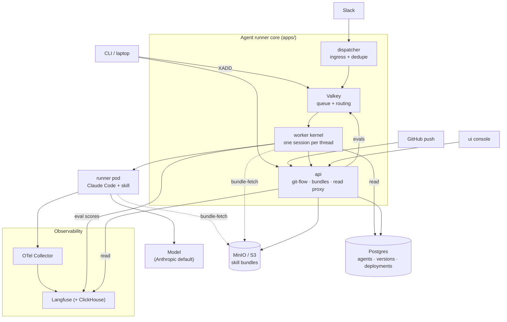
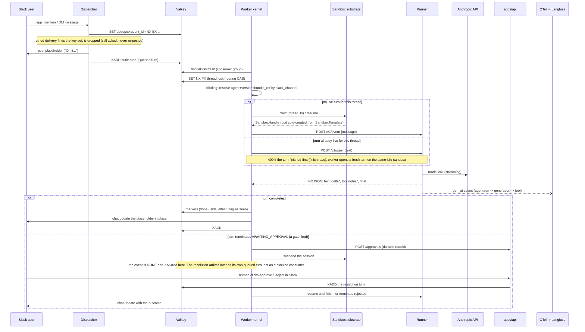
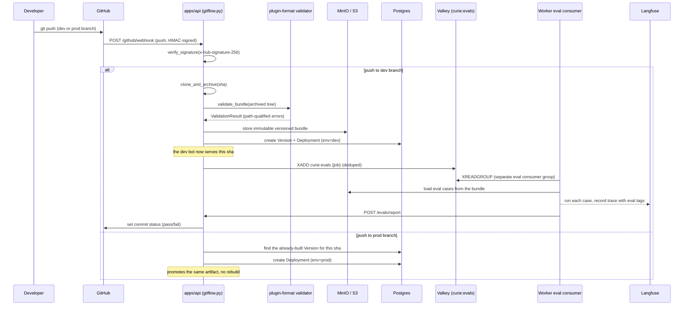

# Curie Architecture (as built)

Curie (codename **Relay**) turns a Slack thread into a conversation with a
versioned, sandboxed AI agent, and turns a git push into a deployment of that
agent. This document is the as-built map: the components, the two runtime modes
and what is identical between them, how one Slack turn and one eval run flow
through the system, how model credentials reach the model, and how traces come
back out.

Every claim carries a repo path you can jump to. Paths are relative to the repo
root. Where main does not yet contain something the design calls for, it is
marked **not yet in main** rather than described as shipped; those items are
tracked in [GitHub issues](https://github.com/curie-eng/curie/issues).

The narrative "why" behind the big calls lives in the ADRs
([`docs/adr/`](docs/adr/)); this doc is the "what talks to what." It supersedes
the pre-build plans that the MVP was built from, which are preserved in git
history.

## 1. One-paragraph frame

Connect Slack, author a Claude-Code-format plugin (skills + tools + MCP) in the
browser or a repo, deploy it as a bot identity, and get traces, evals, budgets,
and git-flow for free. The core loop: a Slack mention lands on the dispatcher,
is enqueued on a Valkey stream, and is picked up by a worker kernel that owns
one live session per thread. The kernel claims a sandbox, drives a runner inside
it over a frozen HTTP/NDJSON protocol, the runner makes the real model call and
streams the reply back, and the worker edits that reply into the Slack
placeholder. The same worker, unchanged, runs against a real Kubernetes cluster
or a local Docker substrate; the CLI can stand in for Slack entirely. That
substrate-agnosticism is the thin-shim thesis and it is the load-bearing
design property of the whole system.

## 2. Component map

This is the static "who talks to whom." For the flows through it, read the
focused diagram docs, each a single clean picture:

- **[How a message comes in and a reply goes out](docs/diagrams/message-flow.md)** — the core loop.
- **[Kubernetes architecture](docs/diagrams/kubernetes.md)** — the cluster and how a sandbox pod is built.
- **[The ACI](docs/diagrams/aci.md)** — the frozen contract between the worker and the agent in the box.



The reply travels back out the way it came in — sandbox to worker to the
originating thread — kept off the diagram to avoid a tangle of return arrows;
[the message-flow doc](docs/diagrams/message-flow.md) shows that round trip.
Two substrate implementations sit behind the single `runner pod` box
(Kubernetes for production, Docker for local); §3 covers that seam.

The worker is not a pass-through between the queue and the sandbox; it is a hub
with four outbound dependencies of its own. It reads the deployment binding from
Postgres ([`apps/worker/src/curie_worker/run.py::build`](apps/worker/src/curie_worker/run.py)
opens the engine on the same `DATABASE_URL` the API uses), fetches a version's
immutable bundle from the object store for eval runs
([`apps/worker/src/curie_worker/eval/stream.py::EvalStreamConsumer`](apps/worker/src/curie_worker/eval/stream.py)),
calls the API for approvals and `POST /evals/report`
([`apps/worker/src/curie_worker/approvals.py::ApprovalClient`](apps/worker/src/curie_worker/approvals.py),
[`apps/worker/src/curie_worker/eval/stream.py::EvalReporter`](apps/worker/src/curie_worker/eval/stream.py)),
and writes eval scores straight to Langfuse
([`apps/worker/src/curie_worker/eval/recorder.py::LangfuseEvalRecorder`](apps/worker/src/curie_worker/eval/recorder.py)).
The worker has **no** OTel dependency — the runner is the only emitter; the
worker's telemetry edge is that eval-score write. The CLI likewise never calls
the dispatcher: it `XADD`s the same `QueuedTurn` the dispatcher would produce
onto the same stream (the `xadd` helper in [`cli/src/queue.rs`](cli/src/queue.rs)),
which is what §3b describes.

### Directory ownership and language

The per-package directory listing — path, language, and what each package owns —
lives in the [README Component map](README.md#component-map). It is not duplicated
here so the two cannot drift apart.

The Python packages are one **uv workspace** (root
[`pyproject.toml`](pyproject.toml)); ruff, mypy, and pytest run across all
members from the root. See the repo [`CLAUDE.md`](CLAUDE.md) for verify commands.

**Adopted, not built** (ADR-0007, [`docs/adr/0007-adopt-not-build-boundaries.md`](docs/adr/0007-adopt-not-build-boundaries.md)):
Langfuse (traces + evals), Kubernetes Agent Sandbox (interactive runtime), Slack
Bolt (Socket Mode), Valkey Streams (queue), Postgres (app state), the OTel
Collector, and the two most load-bearing adopt calls of all — **claude-agent-sdk**
as the harness (ADR-0005) and **the Claude Code plugin format verbatim**, which
ADR-0007 calls "the distribution wedge — do not invent a format".

Curie builds **six** things around that spine: the API, the dispatcher, the
worker+runner glue, the UI, the CLI, and the umbrella Helm chart (§10). The chart
is a built thing, not a packaging afterthought: the security rails are chart
defaults, so the chart is where a rail either ships or does not.

## 3. Two runtime modes, one worker: the thin-shim thesis

The platform never learns which substrate it is running on, and the runner never
learns whether the message came from Slack. Two seams make that true, and both
are real code, not aspiration.

**The system of record for the seams is the interface catalog**
([`docs/interfaces.md`](docs/interfaces.md)), which enumerates them — one
`INTERFACE.md` per seam under [`docs/interfaces/`](docs/interfaces), each carrying
the port, the implementations that exist today, the known leakage, and a grade. The
catalog's seam table is generated from those files' front-matter and gated, so it
cannot quietly drift from them; read the count off that table rather than from prose
here. Its
governing restraint is **"the second implementation teaches the interface"**: a
seam is documented where the code already draws the line, not written speculatively
ahead of a real second implementation. That is why several seams honestly carry one
implementation and a middling grade rather than a fictional adapter layer.

The two seams below are **worked examples, not the list**. Substrate
(`SandboxClient`) is the one with two real implementations, and Slack is the one
whose leakage is most instructive. The rest — among them `StreamBroker`,
`ApproverSet`/`ApprovalCreator`, `MemoryStore`, `TranscriptStore`, `Scorer`,
`ObjectStore`, and `CliOutput` — live in the catalog. Read it there; this section
does not duplicate it.

### 3a. Substrate seam — `SandboxClient`

The worker talks to a `SandboxClient` Protocol
([`apps/worker/src/curie_worker/sandbox/types.py::SandboxClient`](apps/worker/src/curie_worker/sandbox/types.py))
whose methods are `create_claim`, `get_claim`, `delete_claim`, `list_claims`,
`get_sandbox`, `set_sandbox_mode`. Two implementations satisfy it:

- **`KubernetesSandboxClient`** ([`apps/worker/src/curie_worker/sandbox/k8s.py::KubernetesSandboxClient`](apps/worker/src/curie_worker/sandbox/k8s.py)) — creates `SandboxClaim` CRDs against the agent-sandbox controller. The claim references a `SandboxWarmPool` **by name** (`spec.warmPoolRef.name`) and the pod **cold-creates from the `SandboxTemplate`**: the shipped default is `replicas: 0`, meaning no pre-warmed pods, and a real-model claim cold-creates regardless because per-claim env injection cannot bind a pre-warmed pod (the `envVarsInjectionPolicy: Overrides` gotcha). The pool object must still exist — with it absent every claim fails `Ready=False reason=WarmPoolNotFound`. Pre-warming is a dev/fake-model fast path, not the production path ([`charts/curie/templates/agent-sandbox.yaml`](charts/curie/templates/agent-sandbox.yaml)). This is the production path.
- **`DockerSandboxClient`** ([`apps/worker/src/curie_worker/sandbox/docker.py::DockerSandboxClient`](apps/worker/src/curie_worker/sandbox/docker.py)) — runs the same runner image as a local Docker container. This is "middle mode": a full backend on a laptop with no Kubernetes.

Everything above the protocol (the kernel, routing, budgets, kill switch, resume
path) is identical across modes. The runner image, the ACI it speaks, and the
plugin bundle it loads are also identical; only the thing that starts the
container differs.

### 3b. Slack seam — a per-turn reply endpoint and the CLI stub

The worker reaches Slack through a **per-turn** reply target, not a single
worker-global setting. `ReplyHandle.endpoint` on the queued turn carries the base
URL of the channel API that this turn's reply is delivered through
([`packages/aci-protocol/src/aci_protocol/turn.py::ReplyHandle`](packages/aci-protocol/src/aci_protocol/turn.py)),
and the sink builds (and caches) a client per endpoint
([`apps/worker/src/curie_worker/slack_sink.py::AsyncSlackSink`](apps/worker/src/curie_worker/slack_sink.py),
behind the [`SlackSink`](apps/worker/src/curie_worker/slack_sink.py) port).
The worker-global `SLACK_API_BASE_URL`
([`apps/worker/src/curie_worker/config.py::WorkerConfig.slack_api_base_url`](apps/worker/src/curie_worker/config.py))
is now the **fallback**: `endpoint = None` means "use the worker's configured
default", i.e. real Slack. That is what routes a reply back to the ingress that
enqueued the turn, so a real Slack workspace and a no-Slack CLI stub can coexist
on **one** worker rather than needing one worker per channel.

The CLI's `curie local message` path starts a local Slack Web API stub
([`cli/src/chat.rs`](cli/src/chat.rs)), mints the exact `QueuedTurn` the
dispatcher would produce with `endpoint` pointed at the stub, `XADD`s it onto the
very same `curie:runs` stream the dispatcher uses
([`cli/src/queue.rs`](cli/src/queue.rs)), and waits for the worker to
finalize the turn by calling the stub's Slack API back. The worker cannot
distinguish the stub from Slack: same queue payload, same `chat.update` call. This
is what lets D1/F1/I1 and most of E1 be verified with no Slack workspace at all.

The honest limit: the **per-turn payload** is channel-neutral, but the binding
surface is not. The catalog grades the channel/ingress seam `C` with one
implementation, and Slack vocabulary (channel ids, thread ts) still reaches the
control plane — a deployment binds an agent by exact-match on `slack_channel`.
"The system does not care which channel" is true of a turn in flight; it is not yet
true of how an agent gets bound to one.

Net effect: a developer can run the entire product loop — real model call
included — on a laptop with Docker and no cluster and no Slack, and the code
exercised is the code that runs in production.

## 4. Data flow: a Slack mention becomes a threaded reply



The pieces, cited:

- **Dedupe + placeholder + enqueue** live in the dispatcher: dedupe SET NX at [`apps/dispatcher/src/curie_dispatcher/queue.py::claim_event`](apps/dispatcher/src/curie_dispatcher/queue.py), placeholder post at [`apps/dispatcher/src/curie_dispatcher/handlers.py::process_event`](apps/dispatcher/src/curie_dispatcher/handlers.py), `XADD curie:runs` at [`apps/dispatcher/src/curie_dispatcher/queue.py::enqueue`](apps/dispatcher/src/curie_dispatcher/queue.py). Socket Mode handler at [`apps/dispatcher/src/curie_dispatcher/app.py::SocketModeConnection`](apps/dispatcher/src/curie_dispatcher/app.py). The stream name is configured on [`apps/dispatcher/src/curie_dispatcher/config.py::DispatcherConfig`](apps/dispatcher/src/curie_dispatcher/config.py) (default `curie:runs`) and the payload model is the channel-neutral [`packages/aci-protocol/src/aci_protocol/turn.py::QueuedTurn`](packages/aci-protocol/src/aci_protocol/turn.py).
- **The kernel** consumes at [`apps/worker/src/curie_worker/consumer.py::Consumer.run`](apps/worker/src/curie_worker/consumer.py) and processes at [`apps/worker/src/curie_worker/kernel.py::Kernel.process_event`](apps/worker/src/curie_worker/kernel.py). It talks to the runner over `POST /v1/event`, `/v1/steer`, `/v1/interrupt` ([`apps/worker/src/curie_worker/runner_client.py::RunnerClient`](apps/worker/src/curie_worker/runner_client.py)) — the same routes the runner serves at [`runner/src/curie_runner/server.py::create_app`](runner/src/curie_runner/server.py).
- **Deployment binding**: a run resolves its agent, version, and `bundle_ref` by exact-match on `slack_channel` against the active deployment ([`apps/worker/src/curie_worker/binding.py::BindingResolver`](apps/worker/src/curie_worker/binding.py)). This is how one worker serves many agents: the channel selects the bundle.

### The four kernel invariants

Each has an integration test under `apps/worker/tests/`:

1. **One live session per thread.** A Valkey thread lock (`SET NX PX`) is the routing CAS ([`apps/worker/src/curie_worker/threadlock.py::ThreadLock`](apps/worker/src/curie_worker/threadlock.py)).
2. **The finish race.** A follow-up during a live turn is a steer; if the turn finished first, the runner returns 409 and the kernel opens a fresh turn on the same idle sandbox ([`apps/worker/src/curie_worker/kernel.py::Kernel._route_and_start`](apps/worker/src/curie_worker/kernel.py)).
3. **No auto-retry after a side-effectful failure.** If a prior attempt flagged a side effect, the kernel escalates to a human instead of retrying ([`apps/worker/src/curie_worker/kernel.py::Kernel.process_event`](apps/worker/src/curie_worker/kernel.py)).
4. **Crash recovery.** Pending stream entries are reclaimed with `XAUTOCLAIM` ([`apps/worker/src/curie_worker/stream_consumer.py::StreamConsumer._reclaim_once`](apps/worker/src/curie_worker/stream_consumer.py)); the runs consumer group is created at `$` so a cold worker never replays ancient backlog ([`apps/worker/src/curie_worker/consumer.py::Consumer.ensure_group`](apps/worker/src/curie_worker/consumer.py)).

**Kill switch.** A Valkey pub/sub channel `curie:kill-events` plus per-agent
kill keys gate and interrupt live runs for a killed agent
([`apps/worker/src/curie_worker/killswitch.py::KillSwitch`](apps/worker/src/curie_worker/killswitch.py)).

### The approval gate: a turn can end without a reply

A turn does not always terminate in an answer. When a gate fires, the turn
terminates `AWAITING_APPROVAL` and the kernel persists a durable approval record,
then suspends the session until a human resolves it
([`apps/worker/src/curie_worker/kernel.py::Kernel.process_event`](apps/worker/src/curie_worker/kernel.py),
which calls
[`apps/worker/src/curie_worker/kernel.py::Kernel._pause_for_approval`](apps/worker/src/curie_worker/kernel.py); ADR-0010,
[`docs/adr/0010-approval-gates-and-human-in-the-loop.md`](docs/adr/0010-approval-gates-and-human-in-the-loop.md)).
This is the governance story, and it is load-bearing: it is why an agent can hold
a side-effectful tool call rather than firing it.

The design property that makes it survive restarts is that **the paused turn is
not a blocked consumer**. The event is marked done and acked immediately; the
resolution arrives later as its **own** queued turn
([`apps/api/src/curie_api/resumequeue.py::ResumeQueue`](apps/api/src/curie_api/resumequeue.py)
mints it via `resume_turn_for`). Nothing holds a stream entry, a thread lock, or a
worker slot across a human's lunch break.

Two TTLs, and the difference matters:

- **`route_ttl_seconds: int = 3600`** — the live route, one hour ([`apps/worker/src/curie_worker/sandbox/types.py`](apps/worker/src/curie_worker/sandbox/types.py)).
- **`suspended_route_ttl_seconds: int = 86400`** — a **suspended** route survives 24 hours, which is the real budget a human has to click Approve ([`apps/worker/src/curie_worker/sandbox/substrate.py`](apps/worker/src/curie_worker/sandbox/substrate.py) applies it on suspend).

Two background loops close the loop rather than trusting the click to arrive: an
**expiry sweeper** resolves approvals nobody answered
([`apps/api/src/curie_api/sweeper.py::sweep_expired_approvals`](apps/api/src/curie_api/sweeper.py),
looped by `run_expiry_sweeper` in the API lifespan) and a **resume reconciler**
re-drives resolutions whose resume turn never landed
([`apps/api/src/curie_api/resumereconciler.py::ResumeReconciler`](apps/api/src/curie_api/resumereconciler.py)).
Membership for "who may approve" resolves in the API, never in the sandbox
(ADR-0034), the resumed sandbox boots with a scoped state token rather than the
platform key (ADR-0033), and the post-approval allowance is one-shot and bound to
the granting agent (ADR-0035) so an approval cannot be replayed into a standing
permission.

**Suspend/resume is a cold rehydrate, not a live hibernate** (ADR-0003,
[`docs/adr/0003-stateless-first-rehydrate-on-resume.md`](docs/adr/0003-stateless-first-rehydrate-on-resume.md)):
suspending a sandbox deletes its pod; resume creates a fresh one and rehydrates
from history. Prompt-cache warmth is real within one continuous claim and is
never assumed across a suspend. The `thread_ts -> sandbox_id` affinity store
([`apps/worker/src/curie_worker/sandbox/affinity.py`](apps/worker/src/curie_worker/sandbox/affinity.py))
is what routes a thread back to its sandbox.

## 5. Data flow: a git push deploys a bundle and runs evals

A push is HMAC-verified, archived, validated, and stored as an immutable
versioned bundle. A **dev-branch** push builds the artifact and fans out its
eval suite as a CI check; a **prod-branch** push promotes that same artifact
without rebuilding. One diagram, both branches:



- **Git-flow fan-out** in [`apps/api/src/curie_api/gitflow.py`](apps/api/src/curie_api/gitflow.py): HMAC signature verify at [`::verify_signature`](apps/api/src/curie_api/gitflow.py), archive at [`::clone_and_archive`](apps/api/src/curie_api/gitflow.py), and the branch fan-out itself at [`::process_push`](apps/api/src/curie_api/gitflow.py) — one function that resolves the ref to an environment ([`::environment_for_ref`](apps/api/src/curie_api/gitflow.py)), then either archives+validates+stores+creates a Version and enqueues its evals (dev, deduped on redelivery) or **promotes the already-built artifact without rebuilding** (prod). Webhook receiver at [`apps/api/src/curie_api/routers/github.py::github_webhook`](apps/api/src/curie_api/routers/github.py).
- **Eval stream** `curie:evals` is produced by the API ([`apps/api/src/curie_api/evalqueue.py::EVAL_STREAM`](apps/api/src/curie_api/evalqueue.py)) and consumed by the worker's eval consumer, which is a **separate** consumer group from the runs kernel ([`apps/worker/src/curie_worker/eval/stream.py::EvalStreamConsumer`](apps/worker/src/curie_worker/eval/stream.py)). It POSTs results to `/evals/report` ([`apps/worker/src/curie_worker/eval/stream.py::EvalReporter`](apps/worker/src/curie_worker/eval/stream.py)).
- **The eval matrix endpoint** `GET /evals/matrix` reads pass/fail from Langfuse trace tags/metadata, not a scores join ([`apps/api/src/curie_api/routers/evals.py::eval_matrix`](apps/api/src/curie_api/routers/evals.py)). The endpoint is live; the UI matrix view has not yet been bound to it (§8).
- **The manual path** (`GET /agents`, `/agents/{id}/versions`, `/agents/{id}/versions/{vid}/bundle`) and the webhook path terminate at the same `Version`/`Deployment` tables and the same `plugin_format.validate_bundle`, so a plugin authored in the browser, pushed by `curie local deploy`, or promoted by git-flow all go through one pipeline. Bundle store/fetch at [`apps/api/src/curie_api/storage.py::BundleStore`](apps/api/src/curie_api/storage.py) and [`apps/api/src/curie_api/routers/bundles.py::download_bundle`](apps/api/src/curie_api/routers/bundles.py).

## 6. The credential path

A model credential flows from a Helm Secret to the model env variable the SDK
reads, without any application process brokering it:

```
values.agentSandbox.runner.credentials
  -> chart Secret key "agentCredentials"        charts/curie/templates/secrets.yaml
  -> worker env CURIE_CREDENTIALS             charts/curie/templates/worker.yaml
     (also wired as a warm-pod fallback)        charts/curie/templates/agent-sandbox.yaml
  -> worker injects it into the claim's boot env  apps/worker/src/curie_worker/binding.py::apply_model_env
  -> runner maps the prefix onto the SDK env     runner/src/curie_runner/sdk_auth.py::resolve_model_credential
```

The runner's mapping is prefix-based and fails loud on anything it cannot use
([`runner/src/curie_runner/sdk_auth.py::resolve_model_credential`](runner/src/curie_runner/sdk_auth.py)):

- `sk-ant-oat...` -> `CLAUDE_CODE_OAUTH_TOKEN` (checked first; OAuth tokens share the `sk-ant-` prefix).
- `sk-ant-...` -> `ANTHROPIC_API_KEY`.
- `sk-or-...` (OpenRouter) -> routed through the shared **base-URL-override seam**: base URL points at OpenRouter's native Anthropic Messages endpoint, and the real key is placed in `ANTHROPIC_API_KEY` (sent as the `x-api-key` header, which OpenRouter's Anthropic endpoint authenticates on), overriding the non-empty placeholder the seam sets; `ANTHROPIC_AUTH_TOKEN` is left blank. Staying on the Anthropic wire format keeps prompt caching intact.
- `sk-...` (bare OpenAI-style) -> raises `UnsupportedCredentialError` rather than forwarding a key the Anthropic SDK cannot use.
- Anything else -> treated as an OAuth token.

The same base-URL-override seam ([`runner/src/curie_runner/sdk_auth.py::resolve_base_url_override`](runner/src/curie_runner/sdk_auth.py)) is provider-agnostic: it targets any Anthropic-compatible endpoint without a real Anthropic credential. Canonical base URLs ship in `PROVIDER_BASE_URLS` ([`runner/src/curie_runner/sdk_auth.py`](runner/src/curie_runner/sdk_auth.py)): three **provider-native** endpoints — **Zhipu**, **Moonshot**, and **DeepSeek** — are selected by base URL rather than key prefix, and **OpenRouter** is in the same dict for reference even though it is prefix-routed (`sk-or-`) rather than base-URL-selected. A **bundled local model** (opt-in Ollama / Qwen3 demo mode, `--local-model`) rides the same seam.

Every one of these keeps the **Anthropic wire format**, which is the whole point: the module's own comment says they "keep the Anthropic wire format -- and therefore provider automatic prefix caching -- rather than the OpenAI chat-completions shape." So "non-Anthropic providers" are supported; what is genuinely absent is the **native OpenAI wire format**, which is why a bare `sk-...` key raises `UnsupportedCredentialError` instead of being forwarded.

**Per-agent connector secrets.** Beyond the model credential, an agent carries its own connector secrets (a GitHub token, a vendor API key), injected into the claim's boot env at [`apps/worker/src/curie_worker/binding.py::inject_connector_secrets`](apps/worker/src/curie_worker/binding.py) (ADR-0009, [`docs/adr/0009-per-agent-connector-auth.md`](docs/adr/0009-per-agent-connector-auth.md)). Two properties are load-bearing:

- **A reserved-name policy fences agent-supplied env against platform boot vars.** Every secret is filtered through `is_reserved_boot_env_name` regardless of env ordering, so a connector secret named after an ACI contract key or a model credential (e.g. `ANTHROPIC_BASE_URL`) can never clobber it. A reserved name is dropped and logged rather than raising — raising would crash a live claim — and a dropped key never carries its value into the log or the injected-keys marker.
- **These secrets live in their own Kubernetes Secret**, deliberately separate from the chart-managed platform Secret, so one agent's token is not readable by every component in the release. The isolation is the point, not an implementation detail.

An explicit SDK credential already in the env always wins; the mapping is a
no-op when `CURIE_CREDENTIALS` is unset.

**Real model is the default.** The runner makes a real model call unless
`CURIE_FAKE_MODEL` is explicitly set, in which case it swaps in a scripted
`FakeModelSession` ([`runner/src/curie_runner/__main__.py::build_runner`](runner/src/curie_runner/__main__.py)).
`CURIE_FAKE_MODEL` is a test-only knob; the worker's local middle mode defaults
to the real model and treats a missing credential as fail-closed rather than
silently degrading to fake ([`apps/worker/src/curie_worker/binding.py::apply_model_env`](apps/worker/src/curie_worker/binding.py),
[`apps/worker/src/curie_worker/sandbox/docker.py::DockerSandboxClient`](apps/worker/src/curie_worker/sandbox/docker.py)).

## 7. The observability pipeline

```
runner (OTLP spans, resource attr curie.session_id)
  --> OTel Collector (OTLP gRPC 4317 / HTTP 4318 in)
        --> Langfuse v3 over HTTP (ClickHouse-backed)
              <-- apps/api Langfuse proxy (trace tree, metrics, cost)
                    <-- apps/ui Runs / Metrics / Cost / Logs views
```

- The runner emits `gen_ai`-style spans (`agent.run -> generation -> tool`) with a resource including `service.name`, `curie.session_id`, and `curie.sandbox_id` ([`runner/src/curie_runner/otel.py`](runner/src/curie_runner/otel.py)); the `sandbox_id` is what lets a trace be tied back to the sandbox that served it.
- **Langfuse OTLP ingest is HTTP-only**; services send to the OTel Collector (which may take gRPC or HTTP) and the collector always exports to Langfuse over HTTP. Collector config at [`otel/collector-config.yaml`](otel/collector-config.yaml); the load-bearing constraint is documented in [`CLAUDE.md`](CLAUDE.md).
- The API reconstructs the tool-call tree from Langfuse's public API via `parentObservationId` ([`apps/api/src/curie_api/langfuse.py::build_tree`](apps/api/src/curie_api/langfuse.py)) and proxies metrics/cost ([`apps/api/src/curie_api/langfuse.py::LangfuseClient`](apps/api/src/curie_api/langfuse.py), surfaced at [`apps/api/src/curie_api/routers/observability.py`](apps/api/src/curie_api/routers/observability.py)).
- The UI's Runs (`RealTraces.tsx`), Metrics (`RealMetrics.tsx`), Cost (`RealCost.tsx`), and Logs (`RealLogs.tsx`) views render these live in wired mode ([`apps/ui/src/views/obs/`](apps/ui/src/views/obs/)).

The `sandbox_id` is also known worker-side (the affinity store and
`SandboxHandle`), so a trace, its session, and its serving sandbox all line up.
The API hoists it out of the trace's observations onto the trace itself
([`apps/api/src/curie_api/langfuse.py::hoist_sandbox_id`](apps/api/src/curie_api/langfuse.py)),
so sandbox identity is surfaced, not pending.

**The observability CLI.** `curie local observability` prints the local
observability surfaces — the console, Langfuse traces/cost, and the API base — and
`curie cluster observability` is its cluster twin; it is a per-tier subcommand,
not a top-level one ([`cli/src/main.rs`](cli/src/main.rs)). It is deliberately a **thin client over
the same `apps/api` proxy the UI uses, not a second backend** (ADR-0038,
[`docs/adr/0038-observability-cli-helper-for-the-agent-dev-loop.md`](docs/adr/0038-observability-cli-helper-for-the-agent-dev-loop.md));
there is no Prometheus and no separate metrics store behind it. It prints URLs and
opens nothing unless `--open` is passed, and `--json` never opens a browser — the
agent-facing default is inert output.

## 8. UI: one wired build

The UI is always backed by the live API — there is no fixture/demo world and no
`isWired()` branch. Every view fetches from `apps/api` same-origin under `/api`
(proxied by Vite; the API key resolves via [`apps/ui/src/api/config.ts`](apps/ui/src/api/config.ts)).

- **Backed by the real API:** Agents/Fleet, Runs/Traces, Metrics, Logs, Cost, Versions, and create/deploy are all wired to `apps/api`. [`apps/ui/src/views/wired/WiredVersions.tsx`](apps/ui/src/views/wired/WiredVersions.tsx) is a real view with its own rollback test ([`apps/ui/src/views/wired/WiredVersions.rollback.test.tsx`](apps/ui/src/views/wired/WiredVersions.rollback.test.tsx)), and Connections is a real Slack-connect panel ([`apps/ui/src/views/wired/WiredStubs.tsx`](apps/ui/src/views/wired/WiredStubs.tsx)).
- **Not-yet-wired surfaces are honest stubs, never demo data:** Evals, Usage, and Settings render a `ComingSoon` placeholder ([`apps/ui/src/views/wired/WiredStubs.tsx`](apps/ui/src/views/wired/WiredStubs.tsx)); the Memory tab is a coming-soon empty-state ([`apps/ui/src/views/obs/MemoryStub.tsx`](apps/ui/src/views/obs/MemoryStub.tsx)) pending v1.1 memory generation. These stubs state plainly what is not wired yet rather than showing fictional data.

The former `acme-corp` fixture dataset and the `?state=N` / `?api=1` dual-world
gate have been removed (#542): a single build serves the live product, and views
degrade honestly (empty lists, zero metrics) when a workspace is fresh.

## 9. Frozen contracts

Two packages are **frozen interfaces**. Every lane compiles against them across
three languages, so an unreviewed change in one silently breaks the others unless
the schema-compat gate catches it.

- **`packages/aci-protocol`** — the ACI session protocol (open/steer/interrupt, NDJSON `text_delta` / tool notes / `final`, budget, side-effect flag). Pydantic models under [`packages/aci-protocol/src`](packages/aci-protocol/src) are the source of truth; committed JSON Schema under [`schema/`](packages/aci-protocol/schema) and generated TypeScript + Rust under [`generated/`](packages/aci-protocol/generated) are derivatives.
- **`packages/plugin-format`** — the Claude Code plugin bundle shape, verbatim (`plugin.json` + `skills/**/SKILL.md` + `.mcp.json` + `scripts/`). `validate_bundle` lives in [`packages/plugin-format/src`](packages/plugin-format/src) and is the single validator every deploy path calls. Choosing the real Claude Code plugin shape (not an invented format) is the distribution wedge (ADR-0005, [`docs/adr/0005-claude-agent-sdk-adapter-and-frozen-aci.md`](docs/adr/0005-claude-agent-sdk-adapter-and-frozen-aci.md)).

The compat gate regenerates the schema and Rust in-process and fails on drift
([`packages/aci-protocol/tests/test_schema_compat.py`](packages/aci-protocol/tests/test_schema_compat.py)); the
repo-root [`scripts/check-contracts.sh`](scripts/check-contracts.sh) runs the
full regenerate-and-compile sweep. CI enforces it as the `contracts-ts` job
([`.github/workflows/ci.yaml`](.github/workflows/ci.yaml)), which also
`git diff --exit-code`s the generated TypeScript.

A task that needs either package to change **stops and escalates** rather than
working around it — see [`CLAUDE.md`](CLAUDE.md).

## 10. Deployment, CI, and release

**The chart** ([`charts/curie`](charts/curie)) is an umbrella that brings up
Postgres, Valkey, Langfuse, ClickHouse, MinIO, and the OTel Collector, plus
Deployments/Services for api/dispatcher/worker/ui (the dispatcher has no inbound
port and so no Service). Templates under
[`charts/curie/templates/`](charts/curie/templates). Security rails, all as
chart defaults (ADR-0006, [`docs/adr/0006-security-rails-as-chart-defaults.md`](docs/adr/0006-security-rails-as-chart-defaults.md)):

- **Default-deny egress NetworkPolicy** with an explicit `except: 169.254.169.254/32` carve-out so the cloud metadata endpoint stays blocked ([`charts/curie/templates/security-networkpolicy.yaml`](charts/curie/templates/security-networkpolicy.yaml)).
- **gVisor RuntimeClass** option on the runner, plus a preflight Job that runs under the class and fails if the kernel is not gVisor ([`charts/curie/templates/preflight-gvisor.yaml`](charts/curie/templates/preflight-gvisor.yaml)).
- **AVX/ClickHouse preflight** — a blocking pre-install hook that fails when the CPU lacks AVX and the ClickHouse tag is not the SSE4.2-safe pin ([`charts/curie/templates/preflight-avx.yaml`](charts/curie/templates/preflight-avx.yaml)), the productized form of the `:24.8` pin documented in [`CLAUDE.md`](CLAUDE.md).
- **Bundle-fetch init containers** on the sandbox template, fail-closed if a bundle ref is set but no archive is fetched ([`charts/curie/templates/agent-sandbox.yaml`](charts/curie/templates/agent-sandbox.yaml)), with a MinIO egress carve-out.
- **A chart-managed platform Secret** carrying backing-store passwords, Langfuse keys, the model `agentCredentials`, the API key, the GitHub webhook secret, and Slack tokens ([`charts/curie/templates/secrets.yaml`](charts/curie/templates/secrets.yaml)). **Per-agent connector secrets are deliberately a separate Secret** ([`charts/curie/templates/agent-connector-secrets.yaml`](charts/curie/templates/agent-connector-secrets.yaml)) so one agent's token is not readable by every component in the release; see §6.

**Install verification status.** As of **v0.4.0-rc.3** the GHCR-default install is
proven end to end on a fresh k3s cluster: `helm install` from published
sha-pinned GHCR images, a CLI deploy + chat loop answered through an in-cluster
sandbox, and the trace confirmed in the in-cluster Langfuse. A subsequent upgrade
flipped on real model credentials and an in-cluster Slack dispatcher (Socket Mode
connected from the cluster).

**The cold-start rehearsal passed at rc.3** — a timed, README-only run reached a
real Slack approve/reject click driving a real downstream effect, so it is no
longer an outstanding acceptance gate. It surfaced **five** friction findings, not
two. Operational detail lives in [`docs/operations.md`](docs/operations.md).

**Local dev stack** is [`compose.dev.yaml`](compose.dev.yaml): the same backing
components at fixed host ports (see [`CLAUDE.md`](CLAUDE.md)). Every backend
integration test and UI E2E runs against it.

**CI** ([`.github/workflows/ci.yaml`](.github/workflows/ci.yaml)) boots the full
compose stack, runs real Alembic migrations on a virgin Postgres
(`version_table_schema=curie`, [`apps/api/alembic/env.py::do_run_migrations`](apps/api/alembic/env.py)),
then the whole workspace pytest suite against the live services. It defines
**ten** jobs: `python`, `rust`, `contracts-ts`, `ui` (lint + vitest + build +
headless Playwright), `compose`, `images`, `worker-local-image`,
`dispatcher-image-smoke`, `eval-falsifiability`, and `e2e-ladder`. Three of them
(`images`, `worker-local-image`, `dispatcher-image-smoke`) are the image build
gates — an operator reading this list to know what protects a release needs them
named, since a green `python` says nothing about whether the images build.

**Release** ([`.github/workflows/release.yaml`](.github/workflows/release.yaml))
publishes `ghcr.io/curie-eng/curie-{runner,api,dispatcher,worker,ui}` as
multi-arch (`linux/amd64` + `linux/arm64`) manifests (both `latest` and long-SHA
tags) on every push to `main`, plus a sixth image,
**`ghcr.io/curie-eng/curie-worker-local`** (the worker-local overlay, built and
merged by its own `worker-local-build` / `worker-local-merge` jobs). A `v*` tag
additionally cuts a GitHub Release with CLI binaries for
`x86_64-unknown-linux-gnu` and `aarch64-apple-darwin`, and runs the `chart` job,
which packages the **Helm chart** and releases the **compose** artifact. The chart
and compose files are release artifacts in their own right: an operator installs
from those, not from the images alone.

## 11. What is built vs deferred

**Built and live-verified end to end** (a real Slack
conversation on a real model, a GHCR-default `helm install` on a fresh k3s
cluster with the CLI deploy+chat loop answered through an in-cluster sandbox and
an in-cluster Slack dispatcher, and a local middle-mode loop were all exercised —
see §10 for the install-verification detail): the frozen contracts, the API (agents/versions/deployments,
git-flow, evals, Langfuse proxy, bundle pipeline), the runner, the dispatcher,
the worker kernel and its four invariants, both substrate clients, the eval
plane, the chart with its security rails, the CLI, and the wired UI
(create/deploy, Runs, Metrics, Cost, Logs).

**Deferred:** ripping out the UI fixture/showroom surface (the code is still in
the tree; wired-and-live is the target, §8), **running** the soak/chaos suite at
N1 scale (the suite itself is 762 lines of real Python, env-gated on `CURIE_SOAK`
— what is deferred is the run, not the code), the Interview-Me onboarding
compiler, automatic memory generation, and the **native OpenAI wire format**.
These are tracked in [GitHub issues](https://github.com/curie-eng/curie/issues).

Three things previously listed here have **shipped** and are called out because a
stale Deferred list understates the product: sandbox identity is surfaced
([`apps/api/src/curie_api/langfuse.py::hoist_sandbox_id`](apps/api/src/curie_api/langfuse.py)),
the timed README-only cold-start rehearsal **passed at v0.4.0-rc.3** (§10), and
non-Anthropic providers are built — Zhipu, Moonshot, DeepSeek, and OpenRouter all
route today, plus opt-in local Ollama (§6). Only the OpenAI *wire format* is
genuinely absent.
