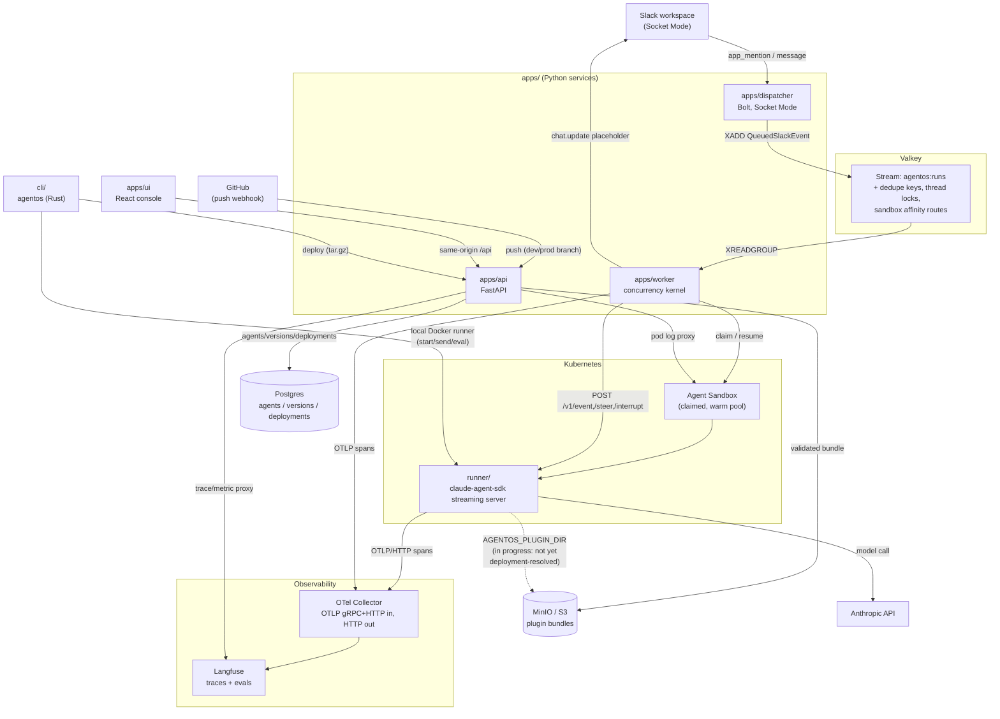
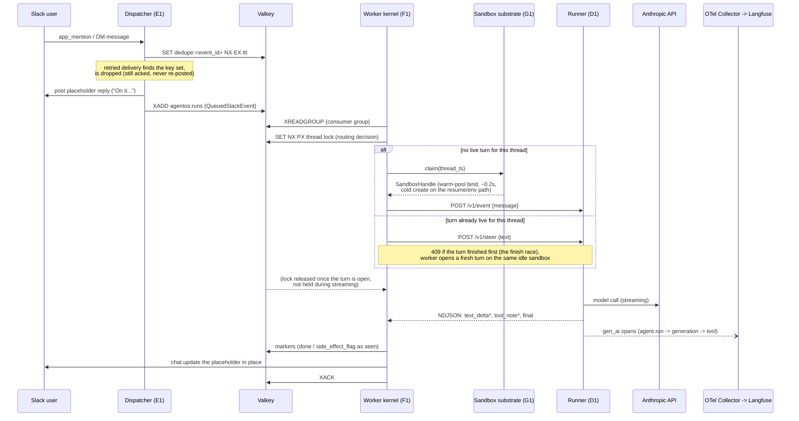
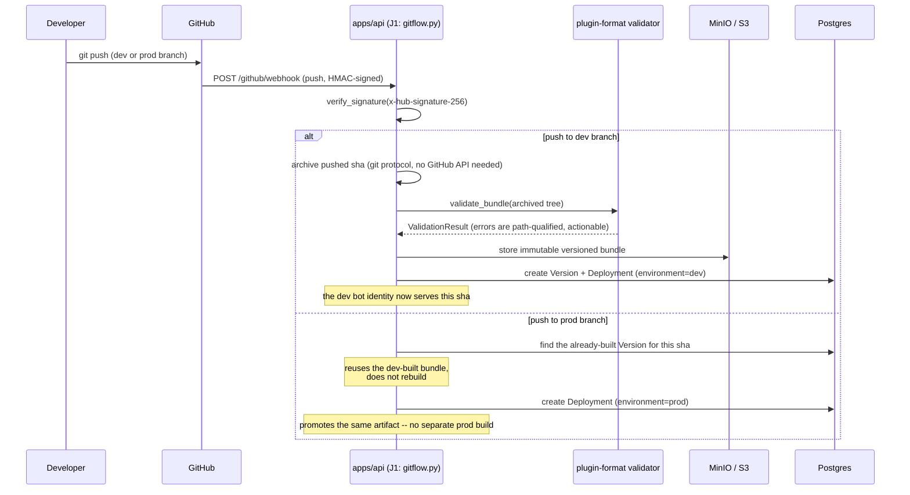

# Architecture

AgentOS turns a Slack thread into a conversation with a versioned, sandboxed AI
agent, and turns a git push into a deployment of that agent. This document is
the map: the components, how a message flows through them, and how a deploy
flows through them. It is a distillation of the reference spec
(`docs/reference/detailed-architecture.md`), the build plan
(`docs/mvp-build-plan.md`), and the ADRs (`docs/adr/`) — read those for the
"why," this doc for the "what talks to what."

Every claim below is checked against the code as of this writing. Where a piece
is designed but not yet wired end to end, it is marked **in progress** rather
than described as shipped.

## Component map

**The frozen seam.** `packages/aci-protocol` (the ACI session protocol: inject /
steer / interrupt / stream NDJSON / budget / side-effect flag) is what the
worker, the runner, the CLI, and the UI's trace viewer all compile against, in
three languages (Python source of truth, generated TypeScript, generated Rust).
`packages/plugin-format` (the Claude Code plugin shape verbatim) is what the
bundle pipeline, the CLI's scaffold, and the runner's bundle loader all
compile against. Both are frozen: see [Frozen contracts](#frozen-contracts)
below and the root `CLAUDE.md`.

**Adopted, not built** (ADR-0007): Langfuse (traces + evals), Kubernetes Agent
Sandbox (interactive runtime), Slack Bolt (Socket Mode), Valkey Streams
(queue), Postgres (app state), the OTel Collector. AgentOS builds five things
around that spine: the API, the dispatcher, the worker+runner glue, the UI,
and the CLI.

## Message flow: a Slack mention becomes a threaded reply

Rules the kernel enforces on this loop (each has an integration test in
`apps/worker/tests/kernel/`): one live session per thread, the finish race
(late steer falls back to a fresh turn), steer-vs-interrupt (steer is the
default; interrupt is the explicit hard stop), and no auto-retry after a
side-effectful failure (it escalates to a human instead). See
`apps/worker/CLAUDE.md` for the enforceable version of these rules.

**Suspend/resume is a cold rehydrate, not a live hibernate** (ADR-0003):
suspending a sandbox deletes its pod; resume creates a fresh one and injects
`AGENTOS_HISTORY_REF` so the runner rehydrates from history. Prompt-cache
warmth is real within one continuous claim and is never assumed across a
suspend.

**In progress:** the worker's sandbox claim does not yet resolve which plugin
bundle/version to mount from the deployment the thread belongs to — today's
kernel is the walking-skeleton shape (one fixed runner image/plugin). Wiring
`agentos:runs` events to a specific `deployment_id` and injecting that
deployment's bundle at claim time is part of the remaining Wave 3/4 work
(tracked informally as the SK walking-skeleton gate).

## Deploy flow: a git push becomes a bot identity

`GET /agents`, `/agents/{id}/versions`, `/agents/{id}/versions/{vid}/bundle`
(the CLI's and UI's manual path) and the webhook path both terminate at the
same `Version`/`Deployment` tables in Postgres and the same bundle validator
(`plugin_format.validate_bundle`), so a plugin authored in the browser, pushed
from a CLI `agentos deploy`, or promoted by git-flow all go through one
pipeline. See `apps/api/CLAUDE.md` and `packages/CLAUDE.md`.

## Frozen contracts

Two packages are **frozen interfaces**: every lane compiles against them, so
an unreviewed change in one breaks every other lane silently unless the
schema-compat CI gate catches it.

- **`packages/aci-protocol`** — the ACI session protocol. Pydantic models are
  the source of truth; JSON Schema, generated TypeScript, and generated Rust
  are committed derivatives. `tests/test_schema_compat.py` regenerates them
  in-process and fails on drift.
- **`packages/plugin-format`** — the Claude Code plugin bundle shape,
  verbatim (this is the distribution wedge: compatibility with real Claude
  Code plugins, not an invented format).

A task that needs either package to change **stops and escalates** rather
than working around it — see the root `CLAUDE.md`.

## What is proven vs. what is designed

The infrastructure substrate under this architecture was live-validated on a
real cluster before any of it was built (see `docs/prototype-derisking-review.md`
and the ADRs for the evidence): Agent Sandbox's routable endpoint, warm-pool
sub-second claims, claude-agent-sdk steering/interrupt, prompt-cache reuse
within a claim, Langfuse's trace-tree reconstruction, the security rails
(egress lockdown, secret isolation, non-root/gVisor). What has since been
*built* on top of that proven foundation (per the task DAG in
`docs/build-orchestration-plan.md` and git history): the frozen contracts, the
API server, the runner, the dispatcher, the UI (shell + wired create/deploy/
Runs/Metrics/Logs), the sandbox substrate, the worker kernel, the CLI, the
Helm chart with its security rails (A2), and git-flow (J1).

**Not yet built / explicitly deferred:** the eval runner + PR-check + eval
matrix endpoint (K1), end-to-end budget enforcement wired through the API and
UI Cost view (L1 — the runner already enforces its own per-run token ceiling
and daily USD cap locally), the soak/chaos suite (N1), the walking-skeleton
verification gate (SK) that proves the whole loop live against a real Slack
workspace, the Interview-Me onboarding compiler, and automatic memory
generation. The UI's Fleet, Evals, Versions, Usage, and Cost views still run
on fixture data pending those lanes; see `apps/ui/README.md` for the current
fixture-vs-wired split.
