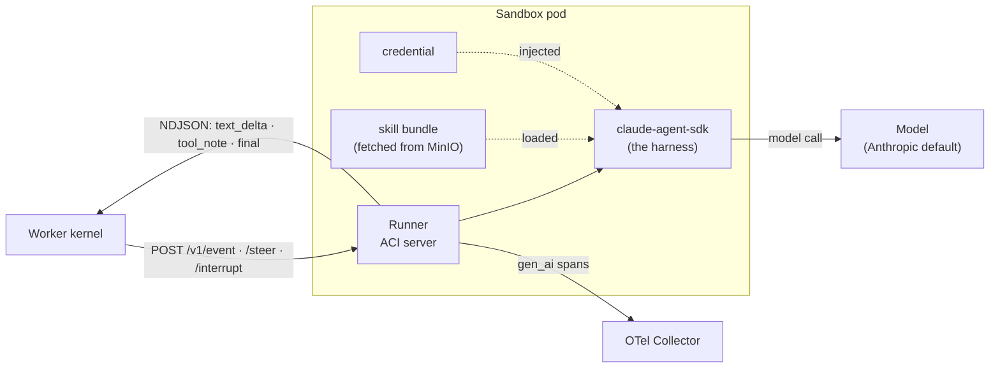

# The ACI: agent container interface

The **ACI** is the frozen contract between the worker and the agent running
inside a sandbox pod. The worker never talks to Claude Code or the model
directly; it talks to a **runner** over a small HTTP/NDJSON protocol. That seam
is what lets the platform stay the same while the thing inside the box (the
harness, the skill, the model) varies.

Think of the sandbox pod as a sealed box with one door. The worker knocks on the
door with an event; the box streams back deltas and a final answer. What happens
inside the box is the runner's business.

## The protocol (worker to runner)

Three routes, served by the runner at
[`runner/src/agentos_runner/server.py`](../../runner/src/agentos_runner/server.py):

| Route | Meaning |
|---|---|
| `POST /v1/event` | Open a turn. Body is an ACI `event` frame; the response streams NDJSON until a `final`. |
| `POST /v1/steer` | Inject a follow-up into the **live** turn (same frame type as `/v1/event`). Returns **409** if no turn is running, so the worker falls back to a fresh `/v1/event`. |
| `POST /v1/interrupt` | Hard-stop the live turn. Body is an ACI `interrupt` frame. |

The reply is a stream of NDJSON events defined in
[`packages/aci-protocol`](../../packages/aci-protocol):

- `text_delta` — streamed answer tokens
- `tool_note` — a tool call the agent made
- `side_effect_flag` — the turn did something with side effects
- `final` — the turn is done (carries the final text + status)
- `error`

## Inside the box

The runner's job on each turn:

1. Accept the ACI `event` frame from the worker.
2. Drive the **harness** (today `claude-agent-sdk`, i.e. Claude Code) loaded with
   the **skill bundle** the init container fetched and the injected
   **credential**.
3. Stream `text_delta` / `tool_note` events back, then a `final`.
4. Emit `gen_ai`-style OTLP spans (`agent.run -> generation -> tool`) tagged with
   the session and sandbox id, so a trace ties back to the pod that served it.

## The credential path

The credential reaches the model without any app process brokering it. The
runner maps a prefixed credential onto the SDK's env var and **fails loud** on
anything it cannot use
([`runner/src/agentos_runner/sdk_auth.py`](../../runner/src/agentos_runner/sdk_auth.py)):

| Credential prefix | Maps to |
|---|---|
| `sk-ant-oat...` | `CLAUDE_CODE_OAUTH_TOKEN` (checked first) |
| `sk-ant-...` | `ANTHROPIC_API_KEY` |
| `sk-or-...` (OpenRouter) | routed through the base-URL-override seam to OpenRouter's Anthropic endpoint |
| `sk-...` (bare OpenAI style) | rejected — the Anthropic SDK cannot use it |
| anything else | treated as an OAuth token |

The **base-URL-override seam** (`resolve_base_url_override`) is how the runner
talks to any Anthropic-compatible endpoint without a real Anthropic credential:
it points `ANTHROPIC_BASE_URL` at the target and carries a non-empty placeholder
`ANTHROPIC_API_KEY` so the bundled CLI's auth gate passes. Both OpenRouter and
the opt-in **bundled local model** (Ollama / Qwen3 demo mode) ride this seam.

**Real model is the default.** The runner makes a real model call unless
`AGENTOS_FAKE_MODEL` is set (a test-only knob that swaps in a scripted fake). A
missing credential is fail-closed, not a silent downgrade to fake.

## Why it is frozen

`packages/aci-protocol` is a **frozen interface** compiled against in Python,
TypeScript, and Rust. The Pydantic models are the source of truth; the JSON
Schema and generated TypeScript/Rust are derivatives, and a CI compat gate fails
on drift. An unreviewed change in one language would silently break the others,
so a task that needs the protocol to change **stops and escalates** rather than
working around it (ADR-0005; see [`ARCHITECTURE.md` §9](../../ARCHITECTURE.md)).

Choosing the real Claude Code plugin shape for skills (rather than an invented
format) is the distribution wedge: a skill authored for Claude Code runs here
unchanged.

## Where this lives in the code

| Piece | Path |
|---|---|
| ACI protocol (frozen) | [`packages/aci-protocol/`](../../packages/aci-protocol) |
| Runner / ACI server | [`runner/src/agentos_runner/server.py`](../../runner/src/agentos_runner/server.py) |
| Runner interface contract | [`runner/src/agentos_runner/INTERFACE.md`](../../runner/src/agentos_runner/INTERFACE.md) |
| Credential mapping + base-URL override | [`runner/src/agentos_runner/sdk_auth.py`](../../runner/src/agentos_runner/sdk_auth.py) |
| Plugin / skill bundle shape | [`packages/plugin-format/`](../../packages/plugin-format) |
