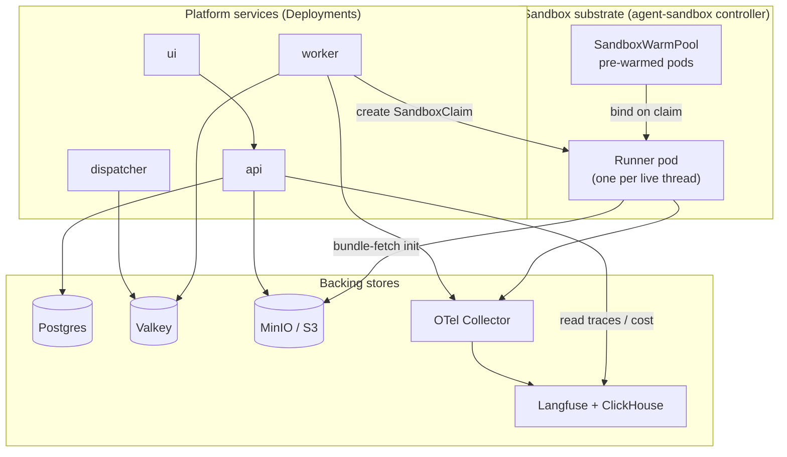
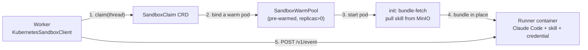

# Kubernetes architecture

What actually runs in the cluster, and how a sandbox pod gets built to serve one
agent turn. This is the "machinery under the hood" that [the message
flow](message-flow.md) glosses over.

The whole thing installs from one umbrella Helm chart
([`charts/agentos`](../../charts/agentos)): the platform services, the backing
stores, the sandbox substrate, and the security rails all come up together.

## The cluster at a glance

## How a sandbox pod is built

A runner pod on its own is just Claude Code with no skill. The agent-sandbox
Kubernetes feature turns it into a ready agent at claim time:

1. The worker's **`KubernetesSandboxClient`** creates a **`SandboxClaim`** CRD.
2. The controller binds a pod from the **`SandboxWarmPool`** (pre-warmed so the
   claim is fast; `replicas: 0` means every claim fails `WarmPoolNotFound`).
3. The pod's **`bundle-fetch` init container** pulls the skill bundle for this
   channel from MinIO before the runner starts. It is **fail-closed**: if a
   bundle ref is set but the archive cannot be fetched, the pod does not start.
4. The runner comes up as a ready agent and the worker drives it over
   [the ACI](aci.md).

Pods are **warm for ~1 hour** after their last turn (see [message
flow](message-flow.md)); after that the claim is released and the next turn on
that thread gets a fresh pod.

## Security rails (all chart defaults)

These are on by default, not opt-in (ADR-0006):

- **Default-deny egress** NetworkPolicy, with a carve-out that keeps the cloud
  metadata endpoint (`169.254.169.254`) blocked and a narrow allow for the MinIO
  bundle fetch. [`security-networkpolicy.yaml`](../../charts/agentos/templates/security-networkpolicy.yaml)
- **gVisor RuntimeClass** on the runner, plus a preflight Job that fails the
  install if the kernel is not gVisor.
  [`preflight-gvisor.yaml`](../../charts/agentos/templates/preflight-gvisor.yaml)
- **AVX / ClickHouse preflight** that blocks install when the CPU cannot run the
  chosen ClickHouse image.
  [`preflight-avx.yaml`](../../charts/agentos/templates/preflight-avx.yaml)
- **One chart-managed Secret** holding the model credential, backing-store
  passwords, Langfuse keys, the API key, the GitHub webhook secret, and Slack
  tokens. [`secrets.yaml`](../../charts/agentos/templates/secrets.yaml)

## The same worker runs without Kubernetes

The worker talks to a `SandboxClient` interface, not to Kubernetes directly.
Swap `KubernetesSandboxClient` for `DockerSandboxClient` and the same worker runs
the same runner image as a local Docker container — a full backend on a laptop,
no cluster. Everything above that seam (routing, budgets, kill switch, resume)
is identical. That substrate-agnosticism is the load-bearing design property;
see [`ARCHITECTURE.md` §3](../../ARCHITECTURE.md).

## Where this lives in the code

| Piece | Path |
|---|---|
| Umbrella chart + templates | [`charts/agentos/templates/`](../../charts/agentos/templates) |
| Sandbox template + warm pool | [`charts/agentos/templates/agent-sandbox.yaml`](../../charts/agentos/templates/agent-sandbox.yaml) |
| Worker's Kubernetes client | [`apps/worker/src/agentos_worker/sandbox/k8s.py`](../../apps/worker/src/agentos_worker/sandbox/k8s.py) |
| Local Docker client | [`apps/worker/src/agentos_worker/sandbox/docker.py`](../../apps/worker/src/agentos_worker/sandbox/docker.py) |
| Install / operations notes | [`operations.md`](../operations.md) |
