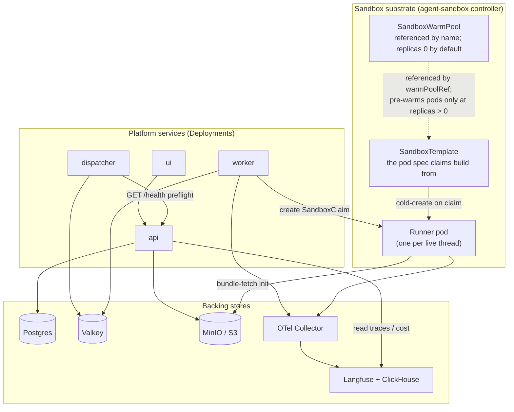
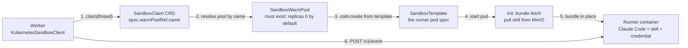
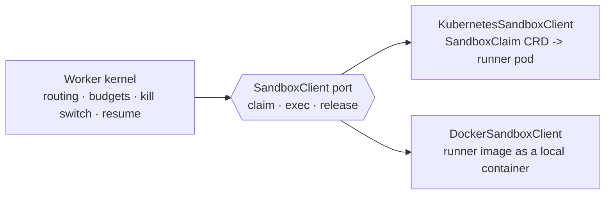

# Kubernetes architecture

What actually runs in the cluster, and how a sandbox pod gets built to serve one
agent turn. This is the "machinery under the hood" that [the message
flow](message-flow.md) glosses over.

The whole thing installs from one umbrella Helm chart
([`charts/curie`](../../charts/curie)): the platform services, the backing
stores, the sandbox substrate, and the security rails all come up together.

## The cluster at a glance

## How a sandbox pod is built

A runner pod on its own is just Claude Code with no skill. The agent-sandbox
Kubernetes feature turns it into a ready agent at claim time:

1. The worker's **`KubernetesSandboxClient`** creates a **`SandboxClaim`** CRD
   naming a pool in `spec.warmPoolRef.name`
   ([`apps/worker/src/curie_worker/sandbox/k8s.py`](../../apps/worker/src/curie_worker/sandbox/k8s.py)).
2. The controller **resolves that pool by name**. The `SandboxWarmPool` object
   must exist: with it absent every claim fails `Ready=False`
   `reason=WarmPoolNotFound` and the run times out. This is why the chart always
   renders the pool whenever the substrate is deployed, **including at
   `replicas: 0`**.
3. `replicas: 0` is the shipped default and does **not** break claims. It means
   no pre-warmed pods, so the claim **cold-creates a sandbox from the
   `SandboxTemplate`** — the normal path.
4. The pod's **`bundle-fetch` init container** pulls the skill bundle for this
   channel from MinIO before the runner starts. It is **fail-closed**: if a
   bundle ref is set but the archive cannot be fetched, the pod does not start.
5. The runner comes up as a ready agent and the worker drives it over
   [the ACI](aci.md).

**The warm pool is a dev/fake-model fast path only.** Raising `replicas` above 0
is for a fake-model dev pool, where an unbound warm pod boots cleanly. It does
not speed up a real claim, for two independent reasons the chart states at the
pool block in
[`agent-sandbox.yaml`](../../charts/curie/templates/agent-sandbox.yaml): a
real-model warm pod has **no bundle** and crash-loops, and a real claim
**cold-creates anyway** because per-claim env injection cannot bind a pre-warmed
pod (the `envVarsInjectionPolicy: Overrides` gotcha).

Pods are **warm for ~1 hour** after their last turn (see [message
flow](message-flow.md)); after that the claim is released and the next turn on
that thread gets a fresh pod.

## Security rails (all chart defaults)

These are on by default, not opt-in (ADR-0006):

- **Default-deny egress** NetworkPolicy, with a carve-out that keeps the cloud
  metadata endpoint (`169.254.169.254`) blocked and a narrow allow for the MinIO
  bundle fetch. [`security-networkpolicy.yaml`](../../charts/curie/templates/security-networkpolicy.yaml)
- **gVisor RuntimeClass** on the runner, plus a preflight Job that fails the
  install if the kernel is not gVisor.
  [`preflight-gvisor.yaml`](../../charts/curie/templates/preflight-gvisor.yaml)
- **AVX / ClickHouse preflight** that blocks install when the CPU cannot run the
  chosen ClickHouse image.
  [`preflight-avx.yaml`](../../charts/curie/templates/preflight-avx.yaml)
- **Two Secrets, deliberately separate.** The chart-managed **platform** Secret
  holds the model credential, backing-store passwords, Langfuse keys, the API
  key, the GitHub webhook secret, and Slack tokens
  ([`secrets.yaml`](../../charts/curie/templates/secrets.yaml)). **Per-agent
  connector secrets live in their own Secret**
  ([`agent-connector-secrets.yaml`](../../charts/curie/templates/agent-connector-secrets.yaml)),
  injected per claim by
  [`inject_connector_secrets`](../../apps/worker/src/curie_worker/binding.py).
  The split is the point: one agent's connector token is **not** readable by
  every component in the release. A platform Secret mounted into the API,
  worker, and dispatcher would make every agent's third-party credential
  ambiently available to all of them; blast radius is one agent instead.

## The same worker runs without Kubernetes

The worker talks to a `SandboxClient` **port**, not to Kubernetes directly.
Everything on this page sits behind that one line:

Swap `KubernetesSandboxClient` for `DockerSandboxClient` and the same worker runs
the same runner image as a local Docker container — a full backend on a laptop,
no cluster. Everything above that seam (routing, budgets, kill switch, resume)
is identical. That substrate-agnosticism is the load-bearing design property;
see [`ARCHITECTURE.md` §3](../../ARCHITECTURE.md). It is one of the seams
catalogued in [the interface catalog](../interfaces.md) and drawn together in
[the seam overlay](seams.md).

## Where this lives in the code

| Piece | Path |
|---|---|
| Umbrella chart + templates | [`charts/curie/templates/`](../../charts/curie/templates) |
| Sandbox template + warm pool | [`charts/curie/templates/agent-sandbox.yaml`](../../charts/curie/templates/agent-sandbox.yaml) |
| Worker's Kubernetes client | [`apps/worker/src/curie_worker/sandbox/k8s.py`](../../apps/worker/src/curie_worker/sandbox/k8s.py) |
| Local Docker client | [`apps/worker/src/curie_worker/sandbox/docker.py`](../../apps/worker/src/curie_worker/sandbox/docker.py) |
| Install / operations notes | [`operations.md`](../operations.md) |
