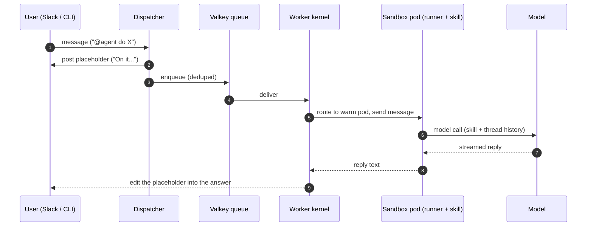
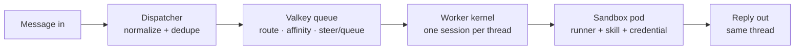

# Message flow: how a message comes in and a reply goes out

This is the core loop. Everything else in AgentOS (the UI, git-flow, evals,
observability) is machinery around this one path: **a message comes into the
system, an agent handles it, and a reply goes back to the same thread.**

## The one-sentence version

A message arrives on a channel, the dispatcher normalizes it and drops it on a
queue, the worker routes it to a sandbox pod running the right skill, the agent
inside that pod calls the model and streams an answer back, and the worker edits
that answer into the thread the message came from.

## The round trip

## The pieces, in the order a message hits them

### 1. The channel is pluggable

Today a message comes from **Slack** (Socket Mode) or the **CLI** (`agentos
local message` / `agentos skill message`, which posts a synthetic event onto the
same queue). The system does not
care which: a message is just a message. Email, Teams, or a Jira comment are the
same integration point later. The dispatcher's whole job is to turn any of those
into one normalized queue event.

### 2. Valkey routes and dedupes

Valkey (a Redis-compatible store) is the traffic controller. It dedupes retried
deliveries, and it holds the **affinity** rules that decide whether this message
goes to a **new** sandbox pod or an **existing** one. Affinity matters because of
caching and steering (below): a follow-up in a live thread must reach the exact
pod already working on it.

### 3. The worker builds (or reuses) a sandbox pod

The worker owns **one live session per thread**. For a new thread it starts a
**sandbox pod** — a Kubernetes-isolated container that is, on its own, just a
bare runner (Claude Code). The pod is assembled at request time:

- pull the **runner** image (Claude Code),
- inject the **skill bundle** for this channel, fetched from MinIO (blob store),
- inject the **credential** and the **thread history**.

That assembled environment is the agent. It runs, emits an answer, and the
worker routes the answer back to the thread.

### 4. Warm pods (the 1-hour rule)

A pod stays warm for about an hour after its last turn. Send a follow-up seven
minutes later and the same warm pod handles it (prompt cache intact). Come back
to yesterday's thread and the old pod is gone, so the worker starts a fresh one
and rehydrates the history.

## Steering vs. queuing

While a turn is running, a follow-up message is **steered** into the live turn
(same as typing a new message to Claude Code mid-task) rather than waiting for it
to finish. That is the default. If the turn happens to finish first, the worker
just opens a fresh turn on the same idle pod — so from the user's side steering
and queuing look the same.

This is why routing to the *right* pod matters: you can only steer a turn if you
know which pod is running it.

## Where this lives in the code

| Step | Code |
|---|---|
| Slack ingress, dedupe, placeholder, enqueue | [`apps/dispatcher/`](../../apps/dispatcher) |
| CLI channel + synthetic event | [`cli/src/chat.rs`](../../cli/src/chat.rs) |
| Queue, thread locks, affinity | [`apps/worker/src/agentos_worker/`](../../apps/worker/src/agentos_worker) |
| Sandbox pod substrate | [`apps/worker/src/agentos_worker/sandbox/`](../../apps/worker/src/agentos_worker/sandbox) |
| The agent inside the pod | [`runner/`](../../runner) — see [the ACI](aci.md) |

For the low-level version (dedupe keys, consumer groups, the finish-race and
crash-recovery invariants), see [`ARCHITECTURE.md` §4](../../ARCHITECTURE.md).
For the pods themselves, see [the Kubernetes architecture](kubernetes.md).
