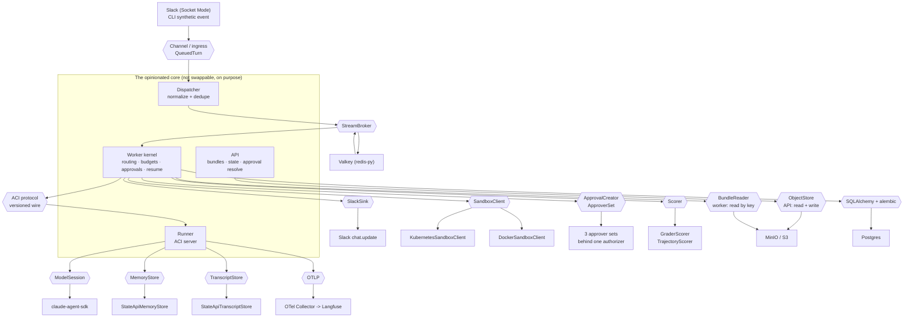

# The seam overlay: where the black lines are

The other diagrams draw **what talks to what**. This one draws **where you could
cut**. Every line below is a place the code already names a port, so one curated
default can be swapped without rewriting the system.

The system of record is [the interface catalog](../interfaces.md) — one entry per
seam, generated from each seam's own front-matter. This page is the picture; the
catalog is the contract, and it wins on any disagreement. The governing
restraint is
[**"the second implementation teaches the interface"**](../architecture-vision.md):
these lines exist because a real second implementation (or a real test fake)
taught them, not because a port looked tidy.

## The overlay

Each `{{hexagon}}` is a port. The box under it is what happens to be plugged in
today.

## The ports, and how honest each line is

Grades are the catalog's, which reproduces
[architecture-vision.md](../architecture-vision.md) verbatim. Only the six
production-platform jobs are graded; the rest are real ports that simply are not
on that table.

| Port | Where the line is drawn | Today | Honesty |
|---|---|---|---|
| `SandboxClient` | [`apps/worker/src/curie_worker/sandbox/k8s.py`](../../apps/worker/src/curie_worker/sandbox/k8s.py) | k8s + docker | **CLEAN, 2 impls.** The strongest claim on this page: two real substrates. [Drawn in detail](kubernetes.md). |
| ACI protocol | [`packages/aci-protocol`](../../packages/aci-protocol) | 1 + reference | **A-.** Versioned wire, tri-language, wire-lock gated. [See the ACI](aci.md). |
| `ModelSession` | [`runner/src/curie_runner/adapter.py`](../../runner/src/curie_runner/adapter.py) | claude-agent-sdk + fake | **A-.** In-proc harness seam. |
| Channel / ingress | [`interfaces/channel-ingress`](../interfaces/channel-ingress/INTERFACE.md) | Slack, CLI stub | **C, 1 impl.** The weakest line here. `QueuedTurn` is channel-neutral; egress is not. |
| `SlackSink` | [`slack_sink.py`](../../apps/worker/src/curie_worker/slack_sink.py) | Slack `chat.update` | Egress assumes edit-in-place. A channel-neutral post/update sink is the open work. |
| `StreamBroker` | [`broker.py`](../../apps/worker/src/curie_worker/broker.py) | redis-py / Valkey | **CLEAN, 1 impl.** Thin port at a non-sacred seam; second broker deferred by decision (ADR-0027). |
| `ObjectStore` | [`storage.py`](../../apps/api/src/curie_api/storage.py) | MinIO / S3 | **B+.** The API's port: read + write. The non-S3 adapter is deferred until real demand (ADR-0026). |
| `BundleReader` | [`bundle_store.py`](../../apps/worker/src/curie_worker/bundle_store.py) | MinIO / S3 | The worker's own read-only slice (`get(key) -> bytes`), a **local Protocol** — the worker deliberately does not import the API package. Two adapters hit the same backend; a second backend must satisfy both. |
| Relational DB | [`interfaces/relational-db`](../interfaces/relational-db/INTERFACE.md) | Postgres | **A-.** The swap is a DSN change, minus two Postgres-isms. |
| `ApprovalCreator` / `ApproverSet` | [`approvals.py`](../../apps/worker/src/curie_worker/approvals.py), [`approvers.py`](../../apps/api/src/curie_api/approvers.py) | 3 approver sets, one authorizer | **CLEAN.** The governance seam ([the approval branch](message-flow.md)). |
| `MemoryStore` | [`runner/src/curie_runner/memory.py`](../../runner/src/curie_runner/memory.py) | `StateApiMemoryStore` | **CLEAN, 1 loader.** |
| `TranscriptStore` | [`runner/src/curie_runner/history.py`](../../runner/src/curie_runner/history.py) | `StateApiTranscriptStore` | **CLEAN, 1 loader.** |
| `Scorer` | [`apps/worker/src/curie_worker/eval/scorer.py`](../../apps/worker/src/curie_worker/eval/scorer.py) | grader + trajectory | **B.** Two real scorers behind one port. |
| Telemetry / OTLP | [`interfaces/telemetry-otel`](../interfaces/telemetry-otel/INTERFACE.md) | Langfuse | **B+.** Write side clean but for three vendor span attributes. |

## What is deliberately not a seam

The core in the diagram above — the dispatcher's normalize/dedupe, the kernel's
routing, budgets, kill switch, approval suspension, and resume — is **not**
swappable, and that is the design. Swappable jobs sit *around* an opinionated
core (ADR-0016); a port at every boundary would be an adapter framework, which
is the thing that restraint exists to prevent.

Five seams in the catalog are not drawn above (bundle format, channel
interaction, model provider, triggers, workflow state) because they are
configuration or format contracts rather than request-path edges. They are in
[the catalog](../interfaces.md) with the rest.

## Where this lives

| Piece | Path |
|---|---|
| The catalog (system of record) | [`docs/interfaces.md`](../interfaces.md) |
| Per-seam contracts | [`docs/interfaces/`](../interfaces) |
| Swap-readiness grades | [`docs/architecture-vision.md`](../architecture-vision.md) |
| The substrate seam in context | [Kubernetes architecture](kubernetes.md) |
| The ACI seam in context | [The ACI](aci.md) |
