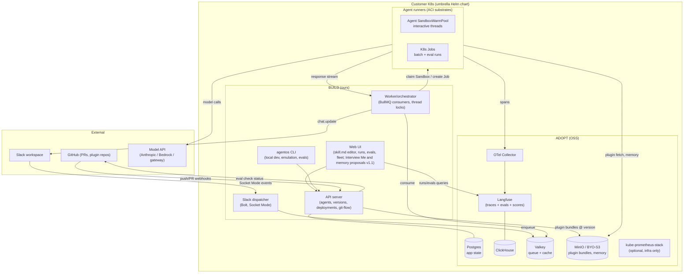
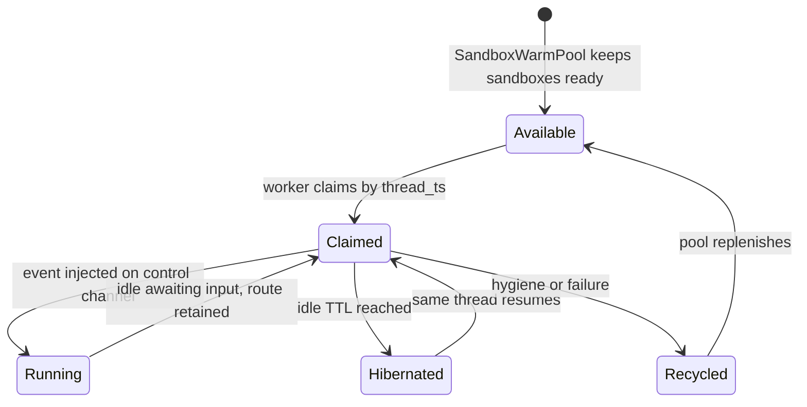
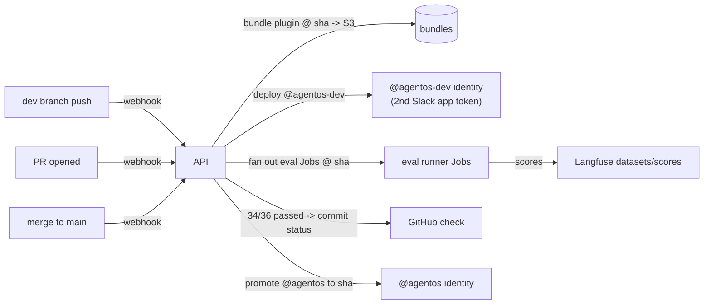
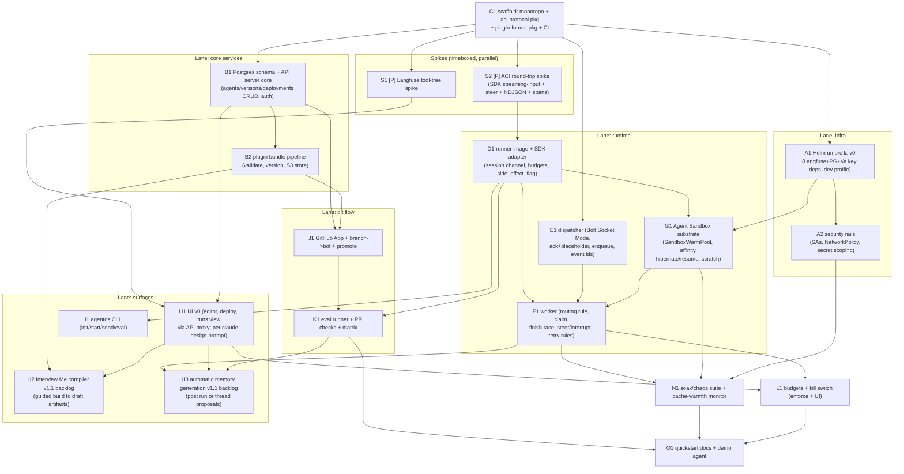

# AgentOS: Detailed Build Architecture (on-prem-first)

Companion to `on-prem-architecture.md` (build-vs-adopt research) and `claude-design-prompt.md` (UI prototype). This is the build-out plan AND the implementation handoff document: component diagram, container contract, run lifecycle, Agent Sandbox substrate, model-access paths, phased milestones, and the task DAG for parallel implementer agents (section 11). Written 2026-07-02.

## Definition of done (v0.1 platform)

The platform is done when these six platform behaviors are real product behavior:

1. Connect Slack; write a skill.md in the browser; Deploy; the agent answers in the Slack thread within seconds — with zero instrumentation steps, traces visible in the Runs view.
2. A follow-up message mid-run steers the in-flight agent (Claude Code semantics); `@agentos stop` interrupts it.
3. `agentos start` runs the same plugin locally; `agentos send "..."` emulates a Slack message with no live workspace; `agentos eval` runs the suite.
4. Push to `dev` deploys `@agentos-dev`; a PR runs the eval suite as a GitHub check ("34/36"); merge to `main` promotes `@agentos`. Eval Matrix compares a suite across N pinned versions.
5. Budgets enforce (per-run token ceiling, daily USD cap, kill switch); a failed run that made a side-effectful tool call escalates instead of retrying.
6. `helm install` on a single 8-10 vCPU / 20 GB node brings up the whole stack (Langfuse backbone included) with security rails on by default; the soak test (concurrent threads + mid-thread batch job + steering + sandbox kill mid-run) passes with no cross-talk, no duplicate side effects, and sandbox-affined thread `cache_read_input_tokens > 0`.

## 0. The ACI: the strong black Docker line

Internal term: **ACI, Agent Container Interface** (deliberately echoing Kubernetes' CRI/CNI/CSI naming: the pluggable-implementation seam). Everything inside the runtime boundary is "the harness"; everything outside is "the platform." The platform never knows which harness is inside; the harness never knows what platform is outside.

For interactive Slack threads, ACI is a claimed Kubernetes Agent Sandbox plus our bidirectional session protocol. The Sandbox gives stable identity, SandboxWarmPool allocation, hibernation/resume, persistent scratch space, and the routable endpoint to the harness. Our protocol gives message injection, steering, interrupt, streamed output, budget enforcement, and side effect flags.

**ACI contract (v0.1 — session-scoped and bidirectional, revised 2026-07-02):**

The contract is a *session*, not a one-shot turn. This is what makes Claude Code-style steering possible: a follow-up message in a Slack thread while the agent is working is delivered INTO the live run (the harness incorporates it at the next loop boundary), exactly like typing a second message into a working Claude Code session.

```
SESSION SETUP (env + mounted files):
  AGENTOS_PLUGIN_DIR      mounted plugin bundle at pinned version (skills/, .mcp.json,
                        scripts/, plugin.json manifest)
  AGENTOS_MEMORY_REF      pointer to externalized memory (S3 path / API URL)
  AGENTOS_CREDENTIALS     injected secrets (per-tool, via K8s Secret refs)
  AGENTOS_SESSION_ID      thread-derived session id (statelessness is the floor,
                        warmth is the optimization)
  AGENTOS_SANDBOX_ID      claimed sandbox id for stable identity and thread routing
  AGENTOS_BUDGET          {max_output_tokens_per_run, task_budget_hint, max_usd_per_day}
  OTEL_EXPORTER_OTLP_*  collector endpoint (traces are non-negotiable)

CHANNEL (HTTP/2 or WebSocket on the sandbox control endpoint, while claimed):
  -> event              {type: message|job|eval_case, text, user, ts}   (initial AND follow-ups)
  -> interrupt          {reason}                                        (hard stop, distinct from steer)
  <- response events    NDJSON: {type: text_delta|tool_note|final|error|side_effect_flag, ...}

OUTPUT (ambient):
  OTel spans            gen_ai.* semconv via mapping layer (semconv still
                        Development-status; we own the mapping)
  exit/idle status      done / idle-awaiting-input / classified failure
```

The claude-agent-sdk adapter implements the channel with the SDK's **streaming-input mode** (the input is an async iterable of user messages; pushing a new message mid-run is first-class, and interrupt is a native control), so steering is not an emulation. It is the Claude Code behavior running server-side. `side_effect_flag` marks runs that executed non-idempotent tool calls (see Steering & retry rules).

Adapters implementing the ACI:
1. **claude-agent-sdk adapter** (default) — MIT, runs the plugin format natively. Model egress required (Anthropic API, Bedrock, Vertex, or gateway — see section 5).
2. **pi/opencode adapter** (air-gapped tier) — BYO local model via vLLM; compat layer guarantees the plugin contract subset (skills + .mcp.json + bundled scripts + memory conventions).

Never OpenClaw (single-context companion shape, cannot multi-tenant).

## 1. System context



Build surface stays exactly five things: UI, API server, dispatcher, worker+runner glue, CLI (Helm chart is the sixth artifact). Interview compilation lives inside the UI and API server, so it changes what Build does, not the component count. Langfuse is the single adopted backbone for observability AND eval storage (MIT core, verified). ClickHouse/Valkey/MinIO arrive as Langfuse dependencies and get reused.

## 2. Run lifecycle (interactive thread)

```mermaid
sequenceDiagram
    participant U as User (Slack)
    participant D as Dispatcher (Bolt)
    participant Q as Valkey queue
    participant W as Worker
    participant R as Agent Sandbox (ACI)
    participant L as Langfuse
    participant M as Model API

    U->>D: @agentos message (thread_ts)
    D->>D: ack < 3s, post "thinking" placeholder
    D->>Q: enqueue {event, thread_ts}
    W->>Q: consume
    W->>W: route lookup (thread_ts -> sandbox_id)<br/>and finish-race lock
    W->>R: claim Sandbox from SandboxWarmPool<br/>when no live route exists
    W->>R: inject initial event or follow-up<br/>on sandbox control channel
    R->>R: fetch plugin @ pinned version on claim;<br/>keep scratch + process warm
    R->>M: agent loop (tools, skills, MCP)
    R--)L: OTel spans (gen_ai.* mapped)
    R--)W: NDJSON response stream
    W--)U: chat.update placeholder in place
    R->>W: idle/hibernate + final
    W->>W: release thread lock, keep route until TTL
```

The per-thread lock plus job-into-live-thread interleaving is the prod-hard kernel (named on [[agent-deployment-model]]); everything else is a state machine around it.

### 2b. Steering & retry rules (decided 2026-07-02)

Target behavior = Claude Code: a message sent while the agent works on that thread **steers** the in-flight run; it does not queue behind it.

1. **One live session per thread.** The per-thread "lock" is really a routing rule: if `thread_ts` maps to a live `sandbox_id`, deliver the new event into that Sandbox control channel (steer); if not, claim a Sandbox and start one. Steering replaces most of the queueing semantics, so follow-ups become deliveries, not queued turns.
2. **The finish race.** A message arriving as the run completes needs atomic check-and-deliver: attempt delivery into the session; if the session reports done/closing, fall back to starting a new run with the message. The worker owns this compare-and-swap; it is the one genuinely fiddly path.
3. **Steer vs interrupt.** Default = steer (mirror Claude Code). Hard stop is explicit: an `interrupt` control triggered by a Slack affordance (e.g. `:stop:` reaction or `@agentos stop`). Do not keyword-guess intent.
4. **Batch jobs never steer.** A cron/batch job targeting a thread with a live interactive session waits for idle (or posts as its own message) — jobs are outputs, not steering inputs.
5. **No auto-retry after side effects.** At-least-once delivery + agent tools = duplicate-action risk. The runner emits `side_effect_flag` once any non-idempotent tool call executes; a failed run with the flag set escalates to a human with the trace instead of retrying. Flag-clean runs retry freely (idempotency key = Slack event id).
6. **Session end = idle timeout** (harness idles, no events for T) or interrupt; the Sandbox route TTL then governs resume behavior and prompt-cache warmth.

## 3. Agent Sandbox as the runtime primitive (v0.1 MVP)

Kubernetes Agent Sandbox is the v0.1 MVP target ACI runtime primitive for interactive Slack thread instantiations. AgentOS treats Agent Sandbox as the adopted runtime substrate rather than building its own long-lived runner pool. The worker claims a Sandbox from `SandboxWarmPool`, records `thread_ts -> sandbox_id`, opens the ACI control channel, and injects the first message. Follow-up Slack messages for the same thread route to the same `sandbox_id` and enter the live control channel.

Two runner substrates remain:

- **Interactive threads -> claimed Agent Sandbox.** Stable sandbox identity, persistent scratch space, hibernation/resume, and a route to the harness are provided by Agent Sandbox. AgentOS owns the ACI protocol running through that route.
- **Batch/eval runs -> K8s Jobs.** Cold start is acceptable for scheduled jobs, eval matrix fan-out, and CI checks. Jobs keep the simple run-to-completion path where no live steering or prompt-cache affinity is needed.



Prompt caching rationale: same thread to same live Sandbox preserves process warmth and gives the best chance that the stable prompt prefix is reused across turns. The smoke test must verify `cache_read_input_tokens > 0` on a sandbox-affined exchange, and cost telemetry should watch cache writes versus cache reads by model and context bucket so a broken affinity path does not become a hidden surcharge.

Fallback posture: plain Jobs or basic pods are dev and break-glass fallbacks only. They can prove the harness and keep batch/eval paths simple, but they are not the target architecture for interactive Slack threads.

## 4. Git flow and evals-as-checks



- Branch→bot identity = two Slack apps + a routing column on the deployment table. Mechanical, and per the competitive scan, occupied by nobody.
- Eval Matrix = same eval Jobs fanned out across N pinned bundle versions; results grid reads from Langfuse (dataset runs keyed by version tag).
- Local: `agentos send "..."` invokes the same ACI container locally with a synthetic event (Slack emulation without a workspace — also occupied by nobody); `agentos eval` runs the suite against local code; `agentos start` prints the boxed env summary.

## 4b. Workflow interview compiler (v1.1, not needed for MVP)

Build v1.1 is not only a blank skill.md editor. It includes Interview Me, a guided compiler for customers who can describe a workflow but do not yet have deployable agent artifacts. This is not needed for the v0.1 MVP.

The interview asks about the workflow, process boundaries, success criteria, repeatability, required tools, permissions, approval points, memory shape, and eval expectations. The API stores the structured answers as draft agent design state, not runtime memory. Automatic memory generation is a separate v1.1 backlog item; Interview Me only captures design time memory expectations.

The compiler emits five artifacts into the normal bundle and eval paths: a draft `skill.md`, a success contract, eval cases, a tool and permission map, and an architecture recommendation. The UI renders those artifacts as editable draft state in the existing deploy flow; the draft `skill.md` and tool map feed the plugin bundle pipeline; the eval cases seed the Langfuse dataset and `agentos eval`; the permission map informs credential scoping and runner NetworkPolicy; the architecture recommendation tells the user whether this should be an interactive Slack teammate, a scheduled job, a human approval flow, or a later manual process.

The refusal condition is product behavior: if success criteria and repeatability are not defined, Interview Me returns not ready to automate with the missing decisions instead of creating a deployable bundle.

## 5. Model access paths (incl. the OpenRouter question)

The harness speaks the **Anthropic Messages API**. Three sanctioned paths, one conditional:

| Path | How | Caching | Verdict |
|---|---|---|---|
| Anthropic API direct | default | native | Default for hosted + most on-prem (egress = prompts only) |
| Bedrock / Vertex | SDK's native provider support (Bedrock Mantle / Vertex clients; Claude Code supports both) | native per provider | The in-their-cloud enterprise path (PrivateLink) |
| **LiteLLM gateway** via `ANTHROPIC_BASE_URL` | gateway exposes an Anthropic-compatible `/v1/messages`; routes onward (incl. to OpenRouter or local vLLM) | survives ONLY if the gateway passes `cache_control` through byte-identically and never reshapes/reorders the request; cache is model-scoped, so any per-turn model swap = 100% cache miss | Supported seam; ship as an optional values toggle (`modelGateway.enabled`) |
| OpenRouter direct | only if consumed through the gateway path above (OpenRouter's native surface is OpenAI-compatible; treat any Anthropic-compat endpoint claim as unverified until tested) | at risk — verify `cache_read_input_tokens` > 0 before trusting it | Do not make it a first-class path; it's a LiteLLM backend config, not architecture |

Hard rule from prior learning: **never put a content-based model router in front of the harness**: Claude Code economics are built on prompt caching (90% discount, 5-min TTL), and per-turn model swapping costs more than straight Opus. The gateway seam exists for billing/routing flexibility and the BYO-model tier, not for dynamic routing. Verification step in the chart's smoke test: one sandbox-affined exchange must show nonzero `cache_read_input_tokens`.

## 6. Umbrella Helm layout (delta from on-prem-architecture.md)

Adds to the earlier tree: `agent-sandbox/` (Agent Sandbox controller wiring, `SandboxWarmPool`, control-channel service, runner image pre-pull), `model-gateway/` (optional LiteLLM subchart, `condition: modelGateway.enabled`), and Job templates for batch/eval runners. All conditionals per-dependency with BYO blocks (Langfuse idiom); camelCase values keys throughout (Go-template gotcha). Single-node dev profile stays ~8-10 vCPU / ~20 GB.

## 6b. Platform opinions: budgets and safety rails (decided 2026-07-02)

**Cost control is a product feature, not a risk item.** The platform is opinionated: every agent carries a budget spec (per-run output-token ceiling, per-agent daily USD cap, optional `task_budget` hint passed through to the model so it self-paces), enforced by the runner and surfaced in the Cost view with a per-agent kill switch. This is the "hard enforcement" positioning applied to spend — Victor-class products can't say this. Defaults ship conservative; overrides are explicit config, never absent config.

**Security fail-safes are chart defaults, not hardening backlog.** The umbrella chart ships with: per-agent K8s ServiceAccounts, NetworkPolicy isolating runner pods (egress = model API + declared MCP endpoints only), secrets scoped per plugin (a runner mounts only its agent's credentials), non-root/read-only-rootfs runner containers, and the interrupt kill path always available. Rationale: the input channel (Slack) is prompt-injectable by anyone in the channel, and runners hold customer credentials; the enterprise security review audits the chart, and retrofitting isolation costs more than defaulting it.

## 7. Build phases

| Phase | Deliverable | Contents | Exit criterion |
|---|---|---|---|
| 0. Spikes (days) | de-risk memos | (a) Langfuse parent-observation reconstructs tool-call trees; (b) ACI container round-trip: synthetic event -> claude-agent-sdk -> NDJSON + spans in Langfuse; (c) cache_read > 0 through Agent Sandbox affinity | all three demonstrated |
| 1. Walking skeleton (1-2 wk) | demoable loop | dispatcher + queue + claimed Agent Sandbox runner + Slack reply + traces in Langfuse; hardcoded single agent | Slack message answered by a plugin, trace visible |
| 2. Platform core (2-3 wk) | API + UI v0 | Postgres schema (agents/versions/deployments), plugin bundle pipeline, browser skill.md editor wired to deploy, runs view on Langfuse API | Claude Design prototype's state-3 flow works for real |
| 3. Git flow + evals (2-3 wk) | CI story | GitHub App, branch->bot identities, eval Jobs, PR checks, eval matrix, `agentos` CLI with local emulation | prototype states 4-5 real |
| 4. Prod-hard (2-4 wk) | first-client grade | Sandbox hibernation/resume hardening + thread locks + interleaving, streaming updates, cost kill-switches, credential broker v0, Helm polish + BYO toggles | soak test: concurrent threads + mid-thread batch job, no cross-talk |
| 4b. v1.1 backlog (later) | workflow compiler + memory proposals | guided workflow interview, draft skill.md, success contract, tool and permission map, architecture recommendation, optional generated eval cases; automatic memory proposals with source evidence, scoped writes, policy or human gate, conflict handling, and telemetry/eval feedback | Interview Me creates editable draft artifacts or returns not ready to automate with missing decisions; memory proposals never silently write |
| 5. Fleet + leave-behind seam (later) | state-6 | fleet dashboard, drift timeline, usage analytics; converges with [[agent-leave-behind-platform]] | TBD |

Sequencing note (from [[curietech-agent-os]] 2026-07-01): first real client engagement funds phases 1-4; platform and plugin layers stay cleanly separated from day one.

## 7b. v1.1 backlog: automatic memory generation (not needed for MVP)

Automatic memory generation is not MVP. It belongs in v1.1, after v0.1 proves the runtime, eval, budget, and safety rails.

In v1.1, AgentOS can propose memory updates after a run or after a thread closes, similar to Claude Tag style: extract candidate durable facts, show the source turn or trace span, and ask for a scoped write. Writes are either human approved or policy gated by tenant rules; no background process silently mutates customer memory.

Memory proposals must be scoped by customer, agent, plugin, environment, and thread. Conflict handling shows the existing memory, the new evidence, confidence, and the proposed resolution instead of overwriting. Eval results and telemetry should feed the policy loop by marking memory writes that improved or degraded later runs.

## 8. Open decisions

1. API server language: TS (Bolt-js + BullMQ, one runtime with the UI) vs Python (Bolt-python + Celery, closer to agent tooling). Lean TS.
2. Agent Sandbox API shape: confirm current CRDs, control-channel route, hibernation/resume hooks, and scratch persistence before implementation. This decides integration details, not whether Agent Sandbox is the target primitive.
3. pi/opencode adapter timing: only when a real air-gapped prospect exists; the ACI keeps the door open at zero cost.
4. Whether the UI reads Langfuse directly (CORS, API keys per project) or proxies through our API (single auth domain). Lean proxy-through-API.

## 9. Handoff contract (read this before implementing anything)

This section is for the implementer agents. The lead decomposes work along section 11's DAG; each task below is sized for one agent with one clean file-ownership boundary.

**Conventions (architectural advisement):**
- Language: **TypeScript** end to end (API server, dispatcher, worker, UI, CLI) — Bolt-js + BullMQ + one runtime. Runner adapter code may be TS or Python (the Agent SDK ships both); pick TS unless a concrete SDK gap appears, and record the decision in the repo's DECISIONS.md if you deviate.
- Monorepo layout: `apps/{api,ui,dispatcher,worker,cli}`, `packages/{aci-protocol,plugin-format,shared}`, `runner/` (image + adapter), `charts/agentos/` (umbrella). One task = one directory; two agents never own the same directory.
- The ACI protocol (section 0) and the plugin bundle format are **frozen interfaces**: change them only via the lead, never unilaterally, because every lane compiles against them. `packages/aci-protocol` is the single source of truth (typed schemas + NDJSON event types), built first (task C1).
- Plugin bundle format = the Claude Code plugin shape verbatim: `plugin.json` manifest + `skills/**/SKILL.md` + `.mcp.json` + `scripts/`. Do not invent a new format; the distribution wedge is compatibility.
- Adopt, don't build: Langfuse for traces+evals (self-host v3), Kubernetes Agent Sandbox for interactive runners, Bolt Socket Mode, BullMQ/Valkey, vanilla Postgres, OTel Collector. Any urge to hand-roll storage/telemetry or the interactive runner substrate is a design error. Stop and escalate.
- Testing: test-first for behavior-bearing code; mock ONLY external services (Slack API, Anthropic API, GitHub); never mock Postgres/Valkey/Langfuse in integration tests (run them via the chart's dev profile / docker compose). Every task's done-when includes its test command passing.
- Helm values keys camelCase (Go-template dot-notation breaks on hyphens); every dependency `condition:`-gated with BYO blocks (Langfuse chart idiom).
- Budgets, security rails, and the no-retry-after-side-effects rule (sections 2b, 6b) are load-bearing product behavior, not hardening backlog — they have their own tasks and their absence fails review.

**Escalation:** if a task's spec conflicts with the frozen interfaces, or an adopted component can't do what a section claims (e.g. Langfuse API can't serve a view), STOP and escalate to the lead with the evidence — do not work around silently.

## 10. Sources (authoritative references)

Companion documents (same folder; the evidence behind every adopt decision):
- `on-prem-architecture.md` — build-vs-adopt verdicts with verbatim license quotes and fetched URLs (Langfuse MIT-core split, Phoenix ELv2 disqualification, SigNoz alternative, Helm compositions, resource estimates).
- `claude-design-prompt.md` — the UI spec: screens, states, design tokens, microcopy, demo states. The UI task implements THIS, not an invented design.
- Wiki context (strategy, not implementation): `~/wiki/pages/supabase-for-agents.md`, `agent-deployment-model.md`, `agent-leave-behind-platform.md`, `curietech-agent-os.md`.

External primary sources (verified 2026-07-02; re-check before relying on a changed behavior):
- Claude Agent SDK: github.com/anthropics/claude-agent-sdk-python + code.claude.com/docs/en/agent-sdk (streaming-input mode, interrupt, OTel env vars, headless hosting).
- Langfuse self-hosting: langfuse.com/self-hosting (v3 components), github.com/langfuse/langfuse-k8s (chart idiom), langfuse.com/docs/open-source (MIT-core scope), api.reference.langfuse.com (datasets/scores/dataset-runs API).
- Slack: slack.dev Bolt-js docs (Socket Mode, 3s ack, Assistant class), api.slack.com rate limits (chat.update cadence).
- Queue: BullMQ docs (docs.bullmq.io) on Valkey/Redis.
- K8s: kubernetes-sigs/agent-sandbox (target Agent Sandbox runtime primitive; re-check current CRDs and hibernation/resume behavior before implementation), OTel GenAI semconv (github.com/open-telemetry/semantic-conventions-genai; Development status, hence our mapping layer).
- LiteLLM Anthropic-format passthrough (docs.litellm.ai) for the optional model-gateway subchart.

## 11. Task DAG (parallelizable breakdown)

Lanes are parallel; arrows are hard dependencies. `[P]` = safely parallelizable with everything else in its row. Every task lists its done-when; "tests pass" always means the task's own suite, run and shown, without weakening assertions.



| Task | Owns | Depends on | Done when |
|---|---|---|---|
| C1 scaffold | repo root, `packages/*`, CI | — | `packages/aci-protocol` + `packages/plugin-format` typecheck with the section-0 event/manifest schemas; CI runs lint+test on PR |
| S1 Langfuse spike | `spikes/s1` | C1 | memo + script proving parent-observation API reconstructs a 3-level tool-call tree for a real trace; explicit GO/NO-GO (NO-GO = ClickHouse SQL fallback chosen) |
| S2 ACI spike | `spikes/s2` | C1 | container accepts initial event + mid-run steer via channel, streams NDJSON, exports gen_ai spans visible in Langfuse; interrupt works |
| A1 Helm v0 | `charts/agentos` | C1 | `helm install` on kind/k3d brings up Langfuse+PG+Valkey+collector with BYO toggles; single-node dev profile documented |
| A2 security rails | `charts/agentos` (policies) | A1 | runner pods run non-root, egress restricted to model API + declared MCP hosts (NetworkPolicy test proves a blocked fetch), per-agent SA + per-plugin secrets |
| B1 API core | `apps/api` | C1 | CRUD + versioning for agents/deployments against real Postgres (integration tests); OpenAPI spec emitted |
| B2 bundle pipeline | `apps/api` (bundles mod) | B1 | a plugin dir uploads -> validated -> immutable versioned bundle in S3/MinIO; fetch-by-version API; malformed bundles rejected with actionable errors |
| D1 runner | `runner/` | S2 | implements full ACI v0.1 incl. AGENTOS_BUDGET enforcement + side_effect_flag; conformance suite in `packages/aci-protocol` passes |
| E1 dispatcher | `apps/dispatcher` | C1 | Slack event -> ack <3s -> placeholder posted -> queued with idempotency key; duplicate Slack retries deduped (test with simulated retry) |
| F1 worker | `apps/worker` | D1,E1,G1 | `thread_ts -> sandbox_id` routing rule + finish-race CAS + control-channel steer/interrupt + no-retry-after-side-effects, each with an integration test; message ordering preserved under concurrent sends |
| G1 Agent Sandbox substrate | `charts/agentos/agent-sandbox` | A1,D1 | `SandboxWarmPool` installs; claim/release records stable `sandbox_id`; hibernation/resume and scratch persistence work; thread affinity survives consecutive turns (`cache_read_input_tokens > 0` proven); sandbox kill mid-run recovers per retry rules |
| H1 UI v0 | `apps/ui` | B1,S1 | states 1-3 of the design prompt work against the real stack; runs view renders tool-call tree from Langfuse via API proxy |
| H2 Interview Me compiler v1.1 backlog | `apps/ui` (interview flow), `apps/api` (interview module) | B1,B2,H1 | captures workflow, process, success, repeatability, tools, permissions, approvals, memory, and eval expectations; not on the critical MVP path; either returns not ready to automate with gaps or emits draft skill.md, success contract, eval cases, tool and permission map, and architecture recommendation into a draft bundle; generated artifacts feed H1's deploy screen, and generated eval cases can extend K1 after v1.1 |
| H3 automatic memory generation v1.1 backlog | `apps/api` (memory proposal module), `apps/ui` (review gate), `apps/worker` (post run hooks) | F1,H1,K1 | proposes candidate memory updates after a run or closed thread with source turn or trace span evidence; scopes writes by customer, agent, plugin, environment, and thread; requires a policy or human gate; surfaces conflicts before write; records telemetry/eval feedback; not on the critical MVP path |
| I1 CLI | `apps/cli` | D1,B1 | `agentos init/start/send/eval` work against local runner with NO Slack workspace; boxed `agentos start` summary per design prompt |
| J1 git flow | `apps/api` (gh module) | B1,B2 | push to dev auto-deploys `@agentos-dev` (second app token); merge promotes; identities routed by deployment table |
| K1 evals | `apps/worker` (eval mod) | J1,D1 | PR opens -> eval Jobs fan out -> GitHub check reports pass/fail; matrix endpoint runs suite across N versions and returns the grid; v1.1 can add Interview Me generated cases as an extension |
| L1 budgets | across api/ui/runner (lead-coordinated seam) | F1,H1 | per-run ceiling + daily cap enforced (test hits cap and run halts gracefully); kill switch stops a live agent < 5s |
| N1 soak | `tests/soak` | F1,G1,A2 | the definition-of-done soak scenario passes 3 consecutive runs, including sandbox kill mid-run and no cross-talk across concurrent threads |
| O1 docs | `docs/` | K1,L1,N1 | a cold reader reaches state-3 (agent live in Slack) from README alone; recorded quickstart < 15 min |

**Non-parallelizable spine:** C1 -> S2 -> D1 -> G1 -> F1 -> N1 (the concurrency kernel must be sequential: one owner, no splitting F1). Everything else parallelizes as drawn: after C1, up to five agents (A1, B1, E1, S1, S2) can run simultaneously; after D1, G1 and I1 can start, with F1 waiting until E1 and G1 land.
