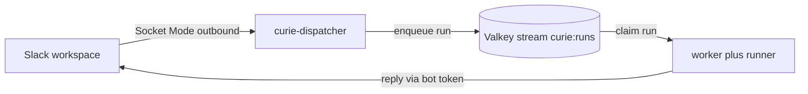

# Connect your own Slack workspace to the local stack

The `local` target (`curie local up`, the full platform via docker compose)
is Slack-free by default: `curie local message` sends a synthetic Slack
event and the worker posts replies at a local stub. This runbook wires a real
Slack app of your own into that same compose stack so you can exercise real
mentions, threads, and streamed replies without a Kubernetes cluster. Reach for
it when you need to see the actual Slack loop (Socket Mode ingestion, in-thread
placeholder, live edits); stay on the Slack-free default for everyday plugin
iteration. Prerequisite: a working `local` stack (see the
[README's local target](../README.md)) and the runner image built once.

The extra piece is an optional `curie-dispatcher` service in
`compose.release.yaml`, gated behind a `slack` compose profile so it stays off
until you opt in with real tokens.



## 1. Create the Slack app

Create the app from the manifest in this repo so the scopes and event
subscriptions are correct from the start.

1. Go to https://api.slack.com/apps, click **Create New App**, choose **From a
   manifest**, pick your workspace, and paste the contents of
   [`../apps/dispatcher/slack-app-manifest.yaml`](../apps/dispatcher/slack-app-manifest.yaml).
   It encodes Socket Mode on, the bot scopes (`app_mentions:read`,
   `chat:write`, `channels:history`, `groups:history`, `im:history`,
   `im:read`, and `assistant:write`), the `app_mention` and `message.im` event
   subscriptions, and interactivity on (so button and block-action clicks
   arrive over Socket Mode).
2. Generate an **App-Level Token** with the `connections:write` scope (Basic
   Information -> App-Level Tokens). This `xapp-...` value is your
   `SLACK_APP_TOKEN`, used for the Socket Mode connection.
3. **Install to Workspace** (Install App), then copy the **Bot User OAuth
   Token**. This `xoxb-...` value is your `SLACK_BOT_TOKEN`, used by the Web API
   to post replies.
4. `SLACK_SIGNING_SECRET` is optional and unused in Socket Mode (kept only for
   Bolt app construction); leave it empty.

The `assistant:write` scope in the manifest is only exercised if you enable the
shimmer status indicator (`CURIE_SHIMMER`), which ALSO requires manually
toggling **Agents & AI Apps** in the app config. That is a one-click manual step
with no manifest key. Skip both if you are not using shimmer.

## 2. Bind an agent to your channel

Connecting Slack is not enough for the bot to reply. The worker resolves an
inbound Slack event to an agent by matching the event's channel id against
`agents.slack_channel` on equality (see
[`../apps/worker/src/curie_worker/binding.py`](../apps/worker/src/curie_worker/binding.py)).
So you must both invite the bot to the channel and deploy an agent bound to
that channel's id.

1. Invite the bot to the channel (`/invite @your-bot` in Slack).
2. Get the channel **ID** (not the name): open channel details and read the id
   at the bottom of the About tab, or take it from the channel URL. It looks
   like `C0123ABCD`.
3. Deploy a plugin bound to that id against the local API (published on host
   port `28000`):

   ```bash
   curie local deploy --plugin-dir ./my-agent --slack-channel C0123ABCD \
     --api-url http://localhost:28000
   ```

The binding value MUST be the channel id (`C0123ABCD`), never the channel name
(`#triage`). A mention in a channel with no bound agent produces no reply. This
is the number-one "nothing happens" failure, so do this before you test.

## 3. Wire the tokens into compose and bring up the `slack` profile

Export the tokens into your shell and start the profile:

```bash
export SLACK_APP_TOKEN=xapp-...
export SLACK_BOT_TOKEN=xoxb-...
export SLACK_API_BASE_URL=          # empty: un-wire the worker's Slack stub -> real slack.com
curie local up --slack

# Raw Docker alternative (the dispatcher depends on valkey, a core service, so
# pair `slack` with a base profile):
docker compose --profile full --profile slack -f compose.release.yaml up -d
```

`curie local up --slack` appends the `slack` profile (the `curie-dispatcher`
service) onto the base `full` profile; `--minimal` pairs it with `core` instead.
The token exports above are still required either way -- the flag only adds the
profile, it does not set `SLACK_API_BASE_URL`.

What each export does:

- `SLACK_APP_TOKEN` and `SLACK_BOT_TOKEN` are read by the `curie-dispatcher`
  service (its `VALKEY_*` connection is already wired to the compose `valkey`
  service). A token-less dispatcher just backoff-reconnects forever, so the
  profile is meaningless without real tokens.
- Setting `SLACK_API_BASE_URL` to an EMPTY string un-wires the worker's Slack
  stub and points its outbound posts at real slack.com. The worker's default is
  `${SLACK_API_BASE_URL-http://localhost:8155/api/}` with a single `-`, so
  leaving the variable UNSET keeps the stub, and setting it empty overrides it.
- The worker reads `SLACK_BOT_TOKEN=${SLACK_BOT_TOKEN:-xoxb-dev}`, so the same
  `export SLACK_BOT_TOKEN` covers BOTH the dispatcher (inbound) and the worker
  (outbound real replies).

Socket Mode is outbound-only: the dispatcher dials Slack over an outbound
WebSocket, so your laptop needs no public ingress, port-forward, or tunnel.

For the dispatcher-internals angle (its process, reconnect behavior, and app
creation details), see the runbook in
[`../apps/dispatcher/README.md`](../apps/dispatcher/README.md).

## 4. Verify

`@mention` the bot in the bound channel, or DM it. Expected: the dispatcher
acks and posts an in-thread placeholder reply, the worker claims the job from
the Valkey stream, and edits the placeholder in place as the real reply streams.

Sanity-check the queue depth inside the valkey container (the stream key is
`curie:runs`):

```bash
docker compose -f compose.release.yaml exec valkey valkey-cli -a valkeypass XLEN curie:runs
```

`valkeypass` is the `.env.example` default (`VALKEY_PASSWORD`); substitute your
own if you overrode it.

## One Socket Mode owner per app token

Slack allows exactly one Socket Mode owner per app token at a time. A local
dispatcher and a cluster dispatcher on the SAME Slack app conflict: it is either
or per app. Stop one before starting the other. This is exactly why the compose
service is off by default behind the profile. The cluster side states the same
constraint: see [`operations.md`](operations.md), which says to stop a local
dispatcher before enabling `dispatcher.deploy=true` in the chart.

## Teardown and return to Slack-free

Stop everything, including the dispatcher:

```bash
curie local down
# or raw: docker compose -f compose.release.yaml down
```

Because the `SLACK_*` exports persist in the shell, a later plain
`curie local up` in the SAME shell keeps the worker pointed at real Slack
(empty `SLACK_API_BASE_URL`) with no dispatcher feeding it. To fully return to
the Slack-free stub, open a fresh shell or unset the variables:

```bash
unset SLACK_API_BASE_URL SLACK_APP_TOKEN SLACK_BOT_TOKEN
```

## Troubleshooting

- **Nothing happens on mention.** Almost always the channel-to-agent binding.
  Check that an agent is deployed with `--slack-channel` set to the channel
  **id** (not `#name`), and that the bot is actually invited to the channel. A
  channel with no bound agent produces no reply.
- **Dispatcher backoff-reconnect loop.** Bad or absent tokens. Confirm
  `SLACK_APP_TOKEN` (`xapp-...`, `connections:write`) and `SLACK_BOT_TOKEN`
  (`xoxb-...`) are exported in the shell that ran `docker compose`.
- **"conflict" or multiple-connection errors.** Two Socket Mode owners on one
  app token (for example a local dispatcher and a cluster dispatcher). Stop one
  before starting the other.
